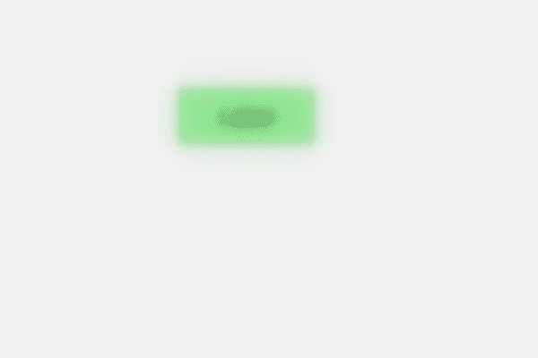

# PyQt5 QLabel–将模糊半径设置为模糊效果

> 原文:[https://www . geeksforgeeks . org/pyqt 5-qlabel-setting-blur-radius-to-blur-effect/](https://www.geeksforgeeks.org/pyqt5-qlabel-setting-blur-radius-to-the-blur-effect/)

在本文中，我们将看到如何将模糊半径设置为标签模糊效果，模糊半径(必需的)，如果设置为 0，阴影将是清晰的，数字越高，它将越模糊。默认情况下，模糊半径值为 5.0，我们可以随时更改它。

为了做到这一点，我们使用`setBlurRadius`方法。

> **语法:**blur_effect . set blur radius(n)
> 这里的 blur _ effect 是 QGraphicsBlurEffect 对象
> 
> **自变量:**以浮点值为自变量
> 
> **返回:**返回无

下面是实现

```py
# importing libraries
from PyQt5.QtWidgets import * 
from PyQt5 import QtCore, QtGui
from PyQt5.QtGui import * 
from PyQt5.QtCore import * 
import sys

class Window(QMainWindow):

    def __init__(self):
        super().__init__()

        # setting title
        self.setWindowTitle("Python ")

        # setting geometry
        self.setGeometry(100, 100, 600, 400)

        # calling method
        self.UiComponents()

        # showing all the widgets
        self.show()

    # method for widgets
    def UiComponents(self):

        # creating label
        label = QLabel("Label", self)

        # setting geometry to the label
        label.setGeometry(200, 100, 150, 60)

        # setting alignment to the label
        label.setAlignment(Qt.AlignCenter)

        # setting font
        label.setFont(QFont('Arial', 15))

        # setting style sheet of the label
        label.setStyleSheet("QLabel"
                            "{"
                            "border : 2px solid green;"
                            "background : lightgreen;"
                            "}")

        # creating a blur effect
        self.blur_effect = QGraphicsBlurEffect()

        # setting blur radius
        self.blur_effect.setBlurRadius(15)

        # adding blur effect to the label
        label.setGraphicsEffect(self.blur_effect)

# create pyqt5 app
App = QApplication(sys.argv)

# create the instance of our Window
window = Window()

# start the app
sys.exit(App.exec())
```

**输出:**
