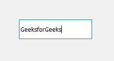

# pyqt 5–qlineedit

> 哎哎哎:# t0]https://www . geeksforgeeks . org/pyqt 5-qlineedit/

**QLineEdit** :它允许用户输入和编辑单行纯文本，具有一系列有用的编辑功能，包括撤销和重做、剪切和粘贴以及拖放。它是 PyQt5 中接收键盘输入的基本小部件，输入可以是文本、数字甚至符号。下面是线路编辑的样子


**示例:**
我们将创建一个行编辑和一个标签，当用户在其中输入文本并按下回车键时，标签将显示输入的文本。

下面是实现

```py
# importing libraries
from PyQt5.QtWidgets import * 
from PyQt5 import QtCore, QtGui
from PyQt5.QtGui import * 
from PyQt5.QtCore import * 
import sys

class Window(QMainWindow):

    def __init__(self):
        super().__init__()

        # setting title
        self.setWindowTitle("Python ")

        # setting geometry
        self.setGeometry(100, 100, 500, 400)

        # calling method
        self.UiComponents()

        # showing all the widgets
        self.show()

    # method for components
    def UiComponents(self):

        # creating a QLineEdit object
        line_edit = QLineEdit("GeeksforGeeks", self)

        # setting geometry
        line_edit.setGeometry(80, 80, 150, 40)

        # creating a label
        label = QLabel("GfG", self)

        # setting geometry to the label
        label.setGeometry(80, 150, 120, 60)

        # setting word wrap property of label
        label.setWordWrap(True)

        # adding action to the line edit when enter key is pressed
        line_edit.returnPressed.connect(lambda: do_action())

        # method to do action
        def do_action():

            # getting text from the line edit
            value = line_edit.text()

            # setting text to the label
            label.setText(value)

# create pyqt5 app
App = QApplication(sys.argv)

# create the instance of our Window
window = Window()

# start the app
sys.exit(App.exec())
```

<video class="wp-video-shortcode" id="video-465367-1" width="640" height="512" preload="metadata" controls=""><source type="video/mp4" src="https://media.geeksforgeeks.org/wp-content/uploads/20200805013711/Python-2020-08-05-01-36-48.mp4?_=1">[https://media.geeksforgeeks.org/wp-content/uploads/20200805013711/Python-2020-08-05-01-36-48.mp4](https://media.geeksforgeeks.org/wp-content/uploads/20200805013711/Python-2020-08-05-01-36-48.mp4)</video>