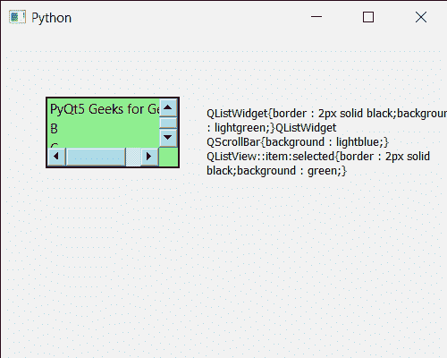

# PYqt5 QlisTwidget–获取样式表

> 原文:[https://www . geeksforgeeks . org/pyqt5-qlistwigt-get-style-sheet/](https://www.geeksforgeeks.org/pyqt5-qlistwidget-getting-style-sheet/)

在本文中，我们将看到如何获得 QListWidget 的样式表。QListWidget 是一个便利类，它提供了一个列表视图，带有一个经典的基于项目的界面，用于添加和删除项目。QListWidget 使用内部模型来管理列表中的每个 QListWidgetItem。样式表是用来使外观更好的属性，即通过创建定制的设计。可以借助 set 样式表方法进行设置。可以借助`setStyleSheet`方法进行设置。

> 为了做到这一点，我们将对列表小部件对象使用`styleSheet`方法。
> 
> **语法:** list_widget .样式表()
> 
> **论证:**需要论证
> 
> **返回:**返回字符串

下面是示例样式表代码

```py
QListWidget
{
border : 2px solid black;
background : lightgreen;
}
QListWidget QScrollBar
{
background : lightblue;
}
 QListView::item:selected
{
border : 2px solid black;
background : green;
}

```

下面是实现

```py
# importing libraries
from PyQt5.QtWidgets import * 
from PyQt5 import QtCore, QtGui
from PyQt5.QtGui import * 
from PyQt5.QtCore import * 
import sys

class Window(QMainWindow):

    def __init__(self):
        super().__init__()

        # setting title
        self.setWindowTitle("Python ")

        # setting geometry
        self.setGeometry(100, 100, 500, 400)

        # calling method
        self.UiComponents()

        # showing all the widgets
        self.show()

    # method for components
    def UiComponents(self):

        # creating a QListWidget
        list_widget = QListWidget(self)

        # setting geometry to it
        list_widget.setGeometry(50, 70, 150, 80)

        # list widget items
        item1 = QListWidgetItem("PyQt5 Geeks for Geeks")
        item2 = QListWidgetItem("B")
        item3 = QListWidgetItem("C")
        item4 = QListWidgetItem("D")

        # adding items to the list widget
        list_widget.addItem(item1)
        list_widget.addItem(item2)
        list_widget.addItem(item3)
        list_widget.addItem(item4)

        # setting style sheet
        list_widget.setStyleSheet("QListWidget"
                                  "{"
                                  "border : 2px solid black;"
                                  "background : lightgreen;"
                                  "}"
                                  "QListWidget QScrollBar"
                                  "{"
                                  "background : lightblue;"
                                  "}"
                                  "QListView::item:selected"
                                  "{"
                                  "border : 2px solid black;"
                                  "background : green;"
                                  "}"
                                  )

        # creating a label
        label = QLabel("GeesforGeeks", self)

        # setting geometry to the label
        label.setGeometry(230, 80, 280, 80)

        # making label multi line
        label.setWordWrap(True)

        # getting style sheet
        value = list_widget.styleSheet()

        # setting text to the label
        label.setText(value)

# create pyqt5 app
App = QApplication(sys.argv)

# create the instance of our Window
window = Window()

# start the app
sys.exit(App.exec())
```

**输出:**
