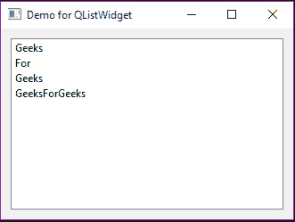

# PyQt5 QListWidget | Python

> 哎哎哎:# t0]https://www . geeksforgeeks . org/pyqt 5-qlistwidget-python/

在 [PyQt](https://www.geeksforgeeks.org/python-introduction-to-pyqt5/) 、 **`QListWidget`** 中是一个便利类，它提供了一个列表视图，带有一个经典的基于项目的添加和删除项目的界面。QListWidget 使用内部模型来管理列表中的每个 QListWidgetItem。

语法:

```py
listWidget = QListWidget()

```

**向列表中添加项目有两种方式。**

1.  它们可以用列表小部件作为它们的父小部件来构建。

    ```py
    QListWidgetItem("Geeks", listWidget)
    QListWidgetItem("For", listWidget)
    QListWidgetItem("Geeks", listWidget)

    ```

2.  它们可以在没有父小部件的情况下构建，并在以后添加到列表中。

    ```py
    listWidgetItem = QListWidgetItem("GeeksForGeeks")
    listWidget.addItem(listWidgetItem)

    ```

QListWidget 中最常用的一些方法:

```py
addItem() : To add QListWidgetItem object in list
addItems() : To add multiple QListWidgetItem objects
insertItem() : It adds item at specified position
clear() : To delete all the items present in the list
count() : To count number of items present in the list
```

以下是代码–

```py
import sys
from PyQt5.QtWidgets import QApplication, QWidget, QListWidget, QVBoxLayout, QListWidgetItem

class Ui_MainWindow(QWidget):
    def __init__(self, parent = None):
        super(Ui_MainWindow, self).__init__(parent)

if __name__ == '__main__':
    app = QApplication(sys.argv)
    window = QWidget()
    listWidget = QListWidget()
    window.setWindowTitle("Demo for QListWidget")

    QListWidgetItem("Geeks", listWidget)
    QListWidgetItem("For", listWidget)
    QListWidgetItem("Geeks", listWidget)

    listWidgetItem = QListWidgetItem("GeeksForGeeks")
    listWidget.addItem(listWidgetItem)

    window_layout = QVBoxLayout(window)
    window_layout.addWidget(listWidget)
    window.setLayout(window_layout)

    window.show()

    sys.exit(app.exec_())
```

**输出:**
