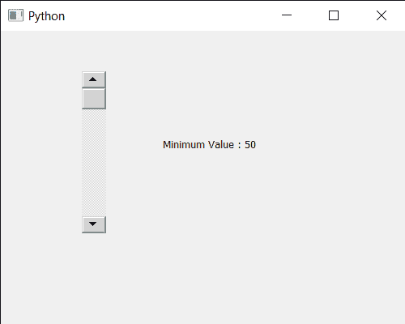

# PyQt5 QScrollBar–获取最小值

> 原文:[https://www . geeksforgeeks . org/pyqt 5-qscrollbar-get-最小值/](https://www.geeksforgeeks.org/pyqt5-qscrollbar-getting-minimum-value/)

在本文中，我们将看到如何获得 QScrollBar 的最小值。QScrollBar 是一个控件，它使用户能够访问比用于显示文档的小部件更大的文档部分。滑块是条内的可滚动对象。默认情况下，值的范围为 0 到 99。数值基本上取决于滑块的位置，滚动条的数值根据滑块的位置而变化，数值在滑块下降时增加，在滑块上升时减少。它可以通过 setValue 方法以编程方式设置。最小值是一个值，低于这个值就不能给它设置任何值，它可以通过 setMinimum 方法来设置。

> 为了做到这一点，我们将使用最小方法与滚动条对象。
> **语法:** scroll.minimum()
> **参数:**不需要参数
> **返回:**返回整数

下面是实现

## 蟒蛇 3

```py
# importing libraries
from PyQt5.QtWidgets import *
from PyQt5 import QtCore, QtGui
from PyQt5.QtGui import *
from PyQt5.QtCore import *
import sys

class Window(QMainWindow):

    def __init__(self):
        super().__init__()

        # setting title
        self.setWindowTitle("Python ")

        # setting geometry
        self.setGeometry(100, 100, 500, 400)

        # calling method
        self.UiComponents()

        # showing all the widgets
        self.show()

    # method for components
    def UiComponents(self):

        scroll = QScrollBar(self)

        # setting geometry of the scroll bar
        scroll.setGeometry(100, 50, 30, 200)

        # setting minimum value of scroll bar
        scroll.setMinimum(50)

        # making its background color to green
        scroll.setStyleSheet("background : lightgrey;")

        # creating a label
        label = QLabel("GeesforGeeks", self)

        # setting geometry to the label
        label.setGeometry(200, 100, 300, 80)

        # making label multi line
        label.setWordWrap(True)

        # getting value changed signal
        scroll.valueChanged.connect(lambda: do_action())

        # method called when signal is emitted
        def do_action():

            # getting current value
            value = scroll.value()

            # setting text to the label
            label.setText("Current Value : " + str(value))

        # getting minimum value
        value = scroll.minimum()

        # setting text to the label
        label.setText("Minimum Value : " + str(value))

# create pyqt5 app
App = QApplication(sys.argv)

# create the instance of our Window
window = Window()

# start the app
sys.exit(App.exec())
```

**输出:**

