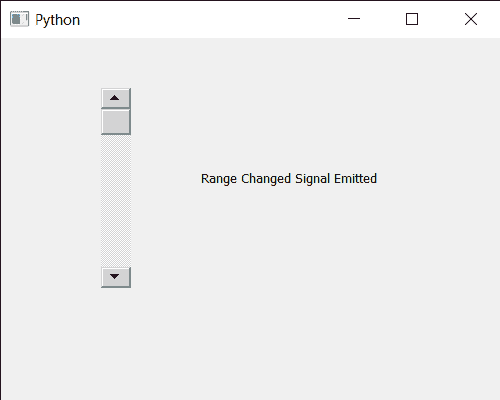

# PyQt5 QScrollBar–获得范围改变信号

> 原文:[https://www . geesforgeks . org/pyqt5-qscrollbar-get-range-changed-signal/](https://www.geeksforgeeks.org/pyqt5-qscrollbar-getting-range-changed-signal/)

在本文中，我们将了解如何获得 QScrollBar 的量程变化信号。QScrollBar 是一个控件，它使用户能够访问比用于显示文档的小部件更大的文档部分。滑块是条内的可滚动对象。默认情况下，值的范围为 0 到 99。数值基本上取决于滑块的位置，滚动条的数值根据滑块的位置而变化，数值在滑块下降时增加，在滑块上升时减少。可以借助`setValue`方法编程设置。范围基本上是最小值和最大值的组合，可以借助`setRange`方法进行设置。当滑块范围发生变化时会发出此信号，最小值为新的最小值，最大值为新的最大值。

> 为此，我们将对滚动条对象使用`rangeChanged`方法。
> 
> **语法:** scroll.rangeChanged.connect(方法)
> 
> **自变量:**以方法为自变量
> 
> **返回:**返回无

下面是实现

```
# importing libraries
from PyQt5.QtWidgets import * 
from PyQt5 import QtCore, QtGui
from PyQt5.QtGui import * 
from PyQt5.QtCore import * 
import sys

class Window(QMainWindow):

    def __init__(self):
        super().__init__()

        # setting title
        self.setWindowTitle("Python ")

        # setting geometry
        self.setGeometry(100, 100, 500, 400)

        # calling method
        self.UiComponents()

        # showing all the widgets
        self.show()

    # method for components
    def UiComponents(self):

        scroll = QScrollBar(self)

        # setting geometry of the scroll bar
        scroll.setGeometry(100, 50, 30, 200)

        # making its background color to green
        scroll.setStyleSheet("background : lightgrey;")

        # creating a label
        label = QLabel("GeesforGeeks", self)

        # setting geometry to the label
        label.setGeometry(200, 100, 300, 80)

        # making label multi line
        label.setWordWrap(True)

        # getting range changed signal
        scroll.rangeChanged.connect(lambda: do_action())

        # method called when signal is emitted
        def do_action():

            # setting text to the label
            label.setText("Range Changed Signal Emitted")

        # setting range of scroll bar
        scroll.setRange(200, 250)

# create pyqt5 app
App = QApplication(sys.argv)

# create the instance of our Window
window = Window()

# start the app
sys.exit(App.exec())
```

**输出:**
