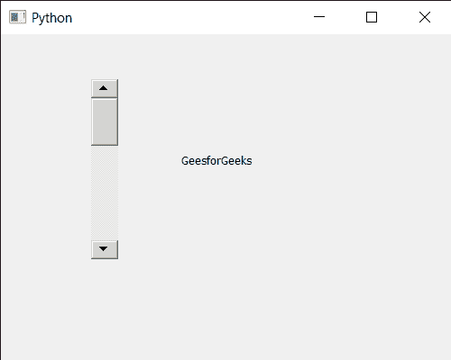

# PyQt5 QScrollBar–设置页面步骤

> 原文:[https://www . geeksforgeeks . org/pyqt 5-qscrollbar-设置-页面-步骤/](https://www.geeksforgeeks.org/pyqt5-qscrollbar-setting-page-step/)

在本文中，我们将看到如何设置 QScrollBar 的页面步骤属性。QScrollBar 是一个控件，它使用户能够访问比用于显示文档的小部件更大的文档部分。滑块是条内的可滚动对象。此属性保存单个步骤。此属性保存页面步骤。抽象滑块提供的两个自然步骤中较大的一个，通常对应于用户按向上翻页或向下翻页。对于滚动条页面，步长将滑块的大小增加到某个点。

> 为此，我们将对滚动条对象使用`setPageStep`方法。
> 
> **语法:**滚动。设置步骤(n)
> 
> **自变量:**以整数为自变量
> 
> **返回:**返回无

下面是实现

```
# importing libraries
from PyQt5.QtWidgets import * 
from PyQt5 import QtCore, QtGui
from PyQt5.QtGui import * 
from PyQt5.QtCore import * 
import sys

class Window(QMainWindow):

    def __init__(self):
        super().__init__()

        # setting title
        self.setWindowTitle("Python ")

        # setting geometry
        self.setGeometry(100, 100, 500, 400)

        # calling method
        self.UiComponents()

        # showing all the widgets
        self.show()

    # method for components
    def UiComponents(self):

        scroll = QScrollBar(self)

        # setting geometry of the scroll bar
        scroll.setGeometry(100, 50, 30, 200)

        # making its background color to green
        scroll.setStyleSheet("background : lightgrey;")

        # setting single step
        scroll.setPageStep(50)

        # creating a label
        label = QLabel("GeesforGeeks", self)

        # setting geometry to the label
        label.setGeometry(200, 100, 300, 80)

        # making label multi line
        label.setWordWrap(True)

        # getting value changed signal
        scroll.valueChanged.connect(lambda: do_action())

        # method called when signal is emitted
        def do_action():

            # setting text to the label
            label.setText("Current Value : " + str(scroll.value()))

# create pyqt5 app
App = QApplication(sys.argv)

# create the instance of our Window
window = Window()

# start the app
sys.exit(App.exec())
```

**输出:**
