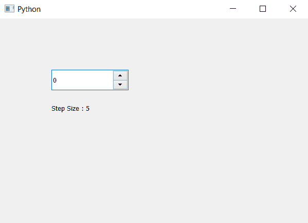

# PyQt5 QSpinBox–访问单步大小

> 原文:[https://www . geeksforgeeks . org/pyqt 5-qspinbox-access-单步大小/](https://www.geeksforgeeks.org/pyqt5-qspinbox-accessing-single-step-size/)

在本文中，我们将看到如何访问旋转框的单步大小，默认情况下，当我们创建旋转框时，它的步长是 1。步长基本上是递增或递减的大小。为了设置步长，我们使用`setSingleStep`方法。

为了做到这一点，我们将使用`singleStep`方法。

> **语法:**旋转框。单步()
> 
> **论证:**不需要论证
> 
> **返回:**返回整数

下面是实现

```
# importing libraries
from PyQt5.QtWidgets import * 
from PyQt5 import QtCore, QtGui
from PyQt5.QtGui import * 
from PyQt5.QtCore import * 
import sys

class Window(QMainWindow):

    def __init__(self):
        super().__init__()

        # setting title
        self.setWindowTitle("Python ")

        # setting geometry
        self.setGeometry(100, 100, 600, 400)

        # calling method
        self.UiComponents()

        # showing all the widgets
        self.show()

    # method for widgets
    def UiComponents(self):

        # creating spin box
        self.spin = QSpinBox(self)

        # setting geometry to spin box
        self.spin.setGeometry(100, 100, 150, 40)

        # setting single step size
        self.spin.setSingleStep(5)

        # creating label
        label = QLabel(self)

        # setting geometry to the label
        label.setGeometry(100, 160, 200, 30)

        # getting single step size
        step = self.spin.singleStep()

        # setting text to the label
        label.setText("Step Size : " + str(step))

# create pyqt5 app
App = QApplication(sys.argv)

# create the instance of our Window
window = Window()

# start the app
sys.exit(App.exec())
```

**输出:**
