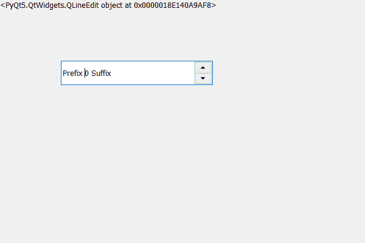

# PyQt5 QSpinbox–访问其行编辑对象

> 原文:[https://www . geeksforgeeks . org/pyqt 5-qspinbox-access-the-line-edit-object-of-it/](https://www.geeksforgeeks.org/pyqt5-qspinbox-accessing-the-line-edit-object-of-it/)

在本文中，我们将看到如何访问旋转框的线编辑对象，线编辑是 PyQt5 中的小部件，用于显示文本和接受输入文本。默认情况下，旋转框有自己的线编辑对象，尽管我们可以借助`setLineEdit`方法向其添加自己的线编辑对象。

> 为了做到这一点，我们使用线编辑方法
> 
> **语法:**旋转框线编辑()
> 
> **论证:**不需要论证
> 
> **返回:**返回线编辑对象

下面是实现

```py
# importing libraries
from PyQt5.QtWidgets import * 
from PyQt5 import QtCore, QtGui
from PyQt5.QtGui import * 
from PyQt5.QtCore import * 
import sys

class Window(QMainWindow):

    def __init__(self):
        super().__init__()

        # setting title
        self.setWindowTitle("Python ")

        # setting geometry
        self.setGeometry(100, 100, 600, 400)

        # calling method
        self.UiComponents()

        # showing all the widgets
        self.show()

    # method for widgets
    def UiComponents(self):
        # creating spin box
        self.spin = QSpinBox(self)

        # setting geometry to spin box
        self.spin.setGeometry(100, 100, 250, 40)

        # setting prefix to spin
        self.spin.setPrefix("Prefix ")

        # setting suffix to spin
        self.spin.setSuffix(" Suffix")

        # get the line edit object of spin box
        line = self.spin.lineEdit()

        # creating a label
        label = QLabel(self)

        # setting text to the label
        label.setText(str(line))

        # adjust the size of the label
        label.adjustSize()

# create pyqt5 app
App = QApplication(sys.argv)

# create the instance of our Window
window = Window()

# start the app
sys.exit(App.exec())
```

**输出:**
