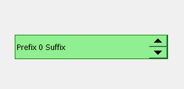
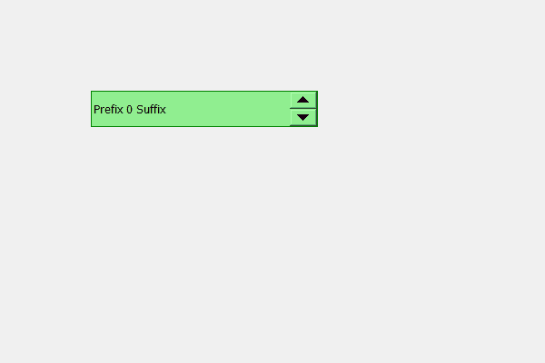

# PyQt5 QSpinBox–添加背景色

> 原文:[https://www . geeksforgeeks . org/pyqt 5-qspinbox-添加-背景色/](https://www.geeksforgeeks.org/pyqt5-qspinbox-adding-background-color/)

在本文中，我们将看到如何设置旋转框的背景色，默认情况下旋转框是白色的，虽然按钮是灰色的，但是我们可以更改白色，下面是旋转框的背景色



为了做到这一点，我们必须改变与旋转框相关的样式表，下面是样式表代码

```py
QSpinBox
{
background-color : lightgreen;
}

```

下面是实现

```py
# importing libraries
from PyQt5.QtWidgets import * 
from PyQt5 import QtCore, QtGui
from PyQt5.QtGui import * 
from PyQt5.QtCore import * 
import sys

class Window(QMainWindow):

    def __init__(self):
        super().__init__()

        # setting title
        self.setWindowTitle("Python ")

        # setting geometry
        self.setGeometry(100, 100, 600, 400)

        # calling method
        self.UiComponents()

        # showing all the widgets
        self.show()

    # method for widgets
    def UiComponents(self):
        # creating spin box
        self.spin = QSpinBox(self)

        # setting geometry to spin box
        self.spin.setGeometry(100, 100, 250, 40)

        # setting prefix to spin
        self.spin.setPrefix("Prefix ")

        # setting suffix to spin
        self.spin.setSuffix(" Suffix")

        # setting style sheet of spin box
        # adding background color
        self.spin.setStyleSheet("QSpinBox"
                                "{"
                                "border : 1px solid green";
                                "background-color : lightgreen;"
                                "}")

# create pyqt5 app
App = QApplication(sys.argv)

# create the instance of our Window
window = Window()

# start the app
sys.exit(App.exec())
```

**输出:**
