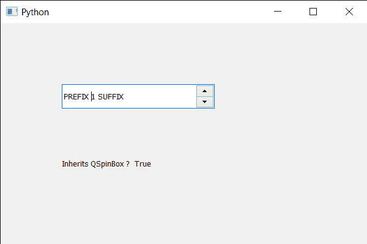

# PyQt5 QSpinBox–检查继承的类

> 原文:[https://www . geeksforgeeks . org/pyqt 5-qspinbox-检查继承类/](https://www.geeksforgeeks.org/pyqt5-qspinbox-checking-for-inherited-class/)

在本文中，我们将看到如何检查自旋盒对象是否继承了给定的类名。检查继承的类意味着如果旋转框对象是继承类名的类的实例或继承类名的 QObject 子类，则它为真，否则为假。

为了做到这一点，我们对旋转框对象使用`inherits`方法。

> **语法:**自旋盒.继承(类名)
> 
> **自变量:**以字符串为自变量
> 
> **返回:**返回 bool

下面是实现

```py
# importing libraries
from PyQt5.QtWidgets import * 
from PyQt5 import QtCore, QtGui
from PyQt5.QtGui import * 
from PyQt5.QtCore import * 
import sys

class Window(QMainWindow):

    def __init__(self):
        super().__init__()

        # setting title
        self.setWindowTitle("Python ")

        # setting geometry
        self.setGeometry(100, 100, 600, 400)

        # calling method
        self.UiComponents()

        # showing all the widgets
        self.show()

        # method for widgets
    def UiComponents(self):
        # creating spin box
        self.spin = QSpinBox(self)

        # setting geometry to spin box
        self.spin.setGeometry(100, 100, 250, 40)

        # setting range to the spin box
        self.spin.setRange(1, 999999)

        # setting prefix to spin
        self.spin.setPrefix("PREFIX ")

        # setting suffix to spin
        self.spin.setSuffix(" SUFFIX")

        # creating a label
        label = QLabel(self)

        # making the label multi line
        label.setWordWrap(True)

        # setting geometry to the label
        label.setGeometry(100, 200, 200, 60)

        # checking if spin inherits "QSpinBox"
        value = self.spin.inherits("QSpinBox")

        # setting text to the label
        label.setText("Inherits QSpinBox ?  " + str(value))

# create pyqt5 app
App = QApplication(sys.argv)

# create the instance of our Window
window = Window()

# start the app
sys.exit(App.exec())
```

**输出:**
