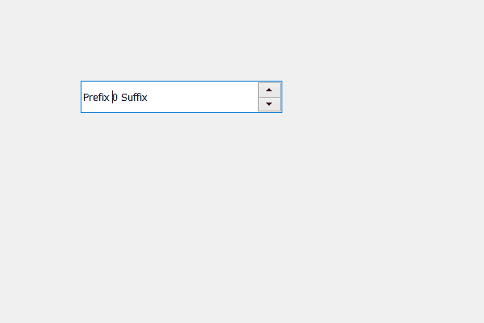

# PyQt5 QSpinBox–使用 isHidden

检查是否隐藏

> 原文:[https://www . geesforgeks . org/pyqt5-qspinbox-checking-if-hidden-using-ishidden/](https://www.geeksforgeeks.org/pyqt5-qspinbox-checking-if-it-is-hidden-using-ishidden/)

在本文中，我们将看到如何借助`isHidden`方法检查旋转框是否隐藏。我们可以使用`hide`方法或`setHidden`方法隐藏旋转框。默认情况下，旋转框可见。

为了做到这一点，我们使用`isHidden`方法。

> **语法:**class _ object . spin _ box . ishidden()
> 
> **论证:**不需要论证
> 
> **返回:**返回 bool

下面是实现

```
# importing libraries
from PyQt5.QtWidgets import * 
from PyQt5 import QtCore, QtGui
from PyQt5.QtGui import * 
from PyQt5.QtCore import * 
import sys

class Window(QMainWindow):

    def __init__(self):
        super().__init__()

        # setting title
        self.setWindowTitle("Python ")

        # setting geometry
        self.setGeometry(100, 100, 600, 400)

        # calling method
        self.UiComponents()

        # showing all the widgets
        self.show()

    # method for widgets
    def UiComponents(self):

        # creating spin box
        self.spin = QSpinBox(self)

        # setting geometry to spin box
        self.spin.setGeometry(100, 100, 250, 40)

        # setting prefix to spin
        self.spin.setPrefix("Prefix ")

        # setting suffix to spin
        self.spin.setSuffix(" Suffix")

# create pyqt5 app
App = QApplication(sys.argv)

# create the instance of our Window
window = Window()

# checking if the spin box was hidden
check = window.spin.isHidden()

# printing the status
print(check)

# start the app
sys.exit(App.exec())
```

**输出:**

```
False
```

