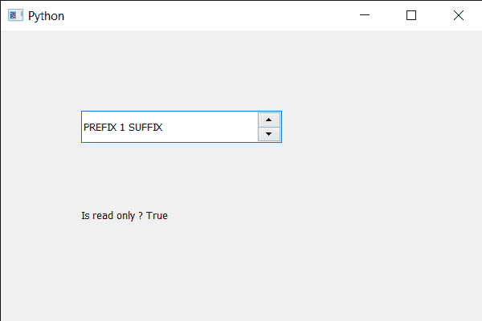

# PyQt5 QSpinBox–检查它是否为只读

> 原文:[https://www . geesforgeks . org/pyqt5-qspinbox-checking-if-it-read-only/](https://www.geeksforgeeks.org/pyqt5-qspinbox-checking-if-it-is-read-only/)

在本文中，我们将看到如何检查旋转框是否是只读的，只读意味着用户不能更改它的值。这类似于禁用旋转框，但是当禁用旋转框时，它的其他属性也会被关闭，但是在只读模式下，没有人可以编辑文本。默认情况下，旋转框是可编辑的，尽管我们可以使用`setReadOnly`方法将其设为只读。

为了做到这一点，我们对旋转框对象使用`isReadOnly`方法。

> **语法:** spin_box.isReadOnly()
> 
> **论证:**不需要论证
> 
> **返回:**返回 bool

下面是实现

```
# importing libraries
from PyQt5.QtWidgets import * 
from PyQt5 import QtCore, QtGui
from PyQt5.QtGui import * 
from PyQt5.QtCore import * 
import sys

class Window(QMainWindow):

    def __init__(self):
        super().__init__()

        # setting title
        self.setWindowTitle("Python ")

        # setting geometry
        self.setGeometry(100, 100, 600, 400)

        # calling method
        self.UiComponents()

        # showing all the widgets
        self.show()

        # method for widgets
    def UiComponents(self):
        # creating spin box
        self.spin = QSpinBox(self)

        # setting geometry to spin box
        self.spin.setGeometry(100, 100, 250, 40)

        # setting range to the spin box
        self.spin.setRange(1, 999999)

        # setting prefix to spin
        self.spin.setPrefix("PREFIX ")

        # setting suffix to spin
        self.spin.setSuffix(" SUFFIX")

        # making spin box read only
        self.spin.setReadOnly(True)

        # creating a label
        self.label = QLabel(self)

        # making label multi line
        self.label.setWordWrap(True)

        # setting label geometry
        self.label.setGeometry(100, 200, 250, 60)

        # checking if spin box is read only
        value = self.spin.isReadOnly()

        # setting text to the label
        self.label.setText("Is read only ? " + str(value))

# create pyqt5 app
App = QApplication(sys.argv)

# create the instance of our Window
window = Window()

# start the app
sys.exit(App.exec())
```

**输出:**

