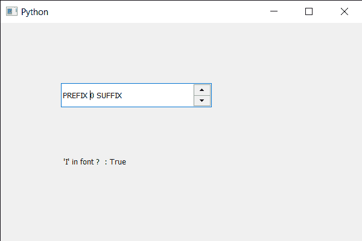

# PyQt5 QSpinBox–检查字符是否为字体

> 原文:[https://www . geesforgeks . org/pyqt5-qspinbox-检查字符是否在字体中/](https://www.geeksforgeeks.org/pyqt5-qspinbox-checking-if-the-character-is-in-font/)

在本文中，我们将看到如何检查给定的字符是否在旋转框的字体中，为了做到这一点，我们必须获得旋转框的 QFontMetrics 对象，这可以借助`fontmetrics`方法来完成。

为了做到这一点，我们对旋转框的 QFontMetrics 对象使用`inFont`方法。

> **语法:** font_metrics.inFont(ch)
> 
> **自变量:**以字符串为自变量
> 
> **返回:**返回 bool。

下面是实现

```
# importing libraries
from PyQt5.QtWidgets import * 
from PyQt5 import QtCore, QtGui
from PyQt5.QtGui import * 
from PyQt5.QtCore import * 
import sys

class Window(QMainWindow):

    def __init__(self):
        super().__init__()

        # setting title
        self.setWindowTitle("Python ")

        # setting geometry
        self.setGeometry(100, 100, 600, 400)

        # calling method
        self.UiComponents()

        # showing all the widgets
        self.show()

        # method for widgets
    def UiComponents(self):
        # creating spin box
        self.spin = QSpinBox(self)

        # setting geometry to spin box
        self.spin.setGeometry(100, 100, 250, 40)

        # setting range to the spin box
        self.spin.setRange(0, 999999)

        # setting prefix to spin
        self.spin.setPrefix("PREFIX ")

        # setting suffix to spin
        self.spin.setSuffix(" SUFFIX")

        # creating a label
        label = QLabel(self)

        # making label multi line
        label.setWordWrap(True)

        # setting geometry to the label
        label.setGeometry(100, 200, 300, 60)

        # getting font metrics
        f_metrics = self.spin.fontMetrics()

        # checking if the character is in the font
        check = f_metrics.inFont('I')

        # setting text to the label
        label.setText(" 'I' in font ?  : " + str(check))

# create pyqt5 app
App = QApplication(sys.argv)

# create the instance of our Window
window = Window()

# start the app
sys.exit(App.exec())
```

**输出:**
