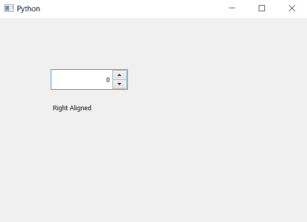

# PyQt5 QSpinBox–检查数值是否在右侧

> 原文:[https://www . geesforgeks . org/pyqt5-qspinbox-检查值是否在右侧/](https://www.geeksforgeeks.org/pyqt5-qspinbox-checking-if-value-is-at-right-side/)

在本文中，我们将看到如何检查值是否出现在旋转框的右侧，当我们创建旋转框时，值在左侧，为了使值在右侧，我们必须将其对齐标志设置为右侧。

为了做到这一点，我们将使用`alignment`方法。

> **语法:**旋转框对齐()
> 
> **论证:**不需要论证
> 
> **返回:**返回 Qt 对象

**实施步骤–**

1.创建一个旋转框
2。借助`setAlignment`方法
3 设置其对齐。创建标签以显示结果
4。借助`alignment`方法
5 获得对准。检查对准是否正确，然后更新标签
6。显示对齐不是右手边

下面是实现

```py
# importing libraries
from PyQt5.QtWidgets import * 
from PyQt5 import QtCore, QtGui
from PyQt5.QtGui import * 
from PyQt5.QtCore import * 
import sys

class Window(QMainWindow):

    def __init__(self):
        super().__init__()

        # setting title
        self.setWindowTitle("Python ")

        # setting geometry
        self.setGeometry(100, 100, 600, 400)

        # calling method
        self.UiComponents()

        # showing all the widgets
        self.show()

    # method for widgets
    def UiComponents(self):

        # creating spin box
        self.spin = QSpinBox(self)

        # setting geometry to spin box
        self.spin.setGeometry(100, 100, 150, 40)

        # alignment
        alignment = Qt.AlignRight

        # setting alignment 
        self.spin.setAlignment(alignment)

        # creating label
        label = QLabel(self)

        # setting geometry to the label
        label.setGeometry(100, 160, 200, 30)

        # getting alignment
        get_alignment = self.spin.alignment()

        # checking if alignment is right
        if get_alignment == Qt.AlignRight:
            text =" Right Aligned"

        else:
            text ="Not right aligned"

        # setting text to the label
        label.setText(text)

# create pyqt5 app
App = QApplication(sys.argv)

# create the instance of our Window
window = Window()

# start the app
sys.exit(App.exec())
```

**输出:**
