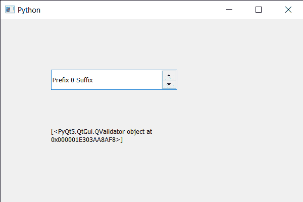

# PyQt5 QSpinBox–使用子类型

查找孩子

> 原文:[https://www . geesforgeks . org/pyqt5-qspinbox-find-children-using-child-type/](https://www.geeksforgeeks.org/pyqt5-qspinbox-finding-children-using-child-type/)

在本文中，我们将看到如何使用子类型找到旋转框的所有子类型，子类型是子的质量，例如，按钮类型是 button。旋转框由两个子框组成，一个是类型为 QLineEdit 的行编辑，另一个是类型为 QValidator 的上下按钮。

> 为此，我们使用 findChildren 方法
> 
> **语法:**旋转框.查找子对象(子类型)
> 
> **参数:**以子类型为参数
> 
> **返回:**返回子对象列表，如果没有找到子对象，返回空列表

下面是实现

```
# importing libraries
from PyQt5.QtWidgets import * 
from PyQt5 import QtCore, QtGui
from PyQt5.QtGui import * 
from PyQt5.QtCore import * 
import sys

class Window(QMainWindow):

    def __init__(self):
        super().__init__()

        # setting title
        self.setWindowTitle("Python ")

        # setting geometry
        self.setGeometry(100, 100, 600, 400)

        # calling method
        self.UiComponents()

        # showing all the widgets
        self.show()

        # method for widgets
    def UiComponents(self):
        # creating spin box
        self.spin = QSpinBox(self)

        # setting geometry to spin box
        self.spin.setGeometry(100, 100, 250, 40)

        # setting range to the spin box
        self.spin.setRange(0, 999999)

        # setting prefix to spin
        self.spin.setPrefix("Prefix ")

        # setting suffix to spin
        self.spin.setSuffix(" Suffix")

        # getting children using child type
        children = self.spin.findChildren(QValidator)

        # creating a label
        label = QLabel(self)

        # making it multi line
        label.setWordWrap(True)

        # setting its geometry
        label.setGeometry(100, 200, 200, 60)

        # setting text to the label
        label.setText(str(children))

# create pyqt5 app
App = QApplication(sys.argv)

# create the instance of our Window
window = Window()

# start the app
sys.exit(App.exec())
```

**输出:**
