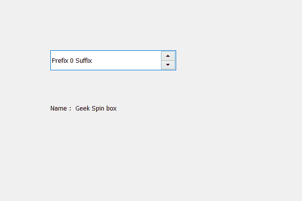

# PyQt5 QSpinBox–获取可访问名称

> 原文:[https://www . geesforgeks . org/pyqt 5-qspinbox-get-access-name/](https://www.geeksforgeeks.org/pyqt5-qspinbox-getting-accessible-name/)

在本文中，我们将看到如何获得旋转框的名称，名称基本上用于区分旋转框，程序员可以根据旋转框的用途为其命名，以便于区分，默认情况下，组合框没有名称。可以使用`setAccessibleName`方法设置名称。

为了做到得到名字我们用`accessibleName`的方法。

> **语法:** spin_box.accessibleName()
> 
> **论证:**不需要论证
> 
> **返回:**返回字符串

下面是实现

```
# importing libraries
from PyQt5.QtWidgets import * 
from PyQt5 import QtCore, QtGui
from PyQt5.QtGui import * 
from PyQt5.QtCore import * 
import sys

class Window(QMainWindow):

    def __init__(self):
        super().__init__()

        # setting title
        self.setWindowTitle("Python ")

        # setting geometry
        self.setGeometry(100, 100, 600, 400)

        # calling method
        self.UiComponents()

        # showing all the widgets
        self.show()

    # method for widgets
    def UiComponents(self):
        # creating spin box
        self.spin = QSpinBox(self)

        # setting geometry to spin box
        self.spin.setGeometry(100, 100, 250, 40)

        # setting prefix to spin
        self.spin.setPrefix("Prefix ")

        # setting suffix to spin
        self.spin.setSuffix(" Suffix")

        # name
        name = " Geek Spin box "

        # setting name to spin box
        self.spin.setAccessibleName(name)

        # creating a label
        label = QLabel(self)

        # getting the name
        get_name = self.spin.accessibleName()

        # setting text to the label
        label.setText("Name : " + get_name)

        # setting geometry to the label
        label.setGeometry(100, 200, 300, 30)

# create pyqt5 app
App = QApplication(sys.argv)

# create the instance of our Window
window = Window()

# start the app
sys.exit(App.exec())
```

**输出:**
