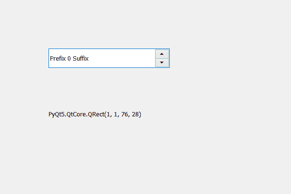

# PyQt5 QSpinBox–获取儿童矩形

> 原文:[https://www . geeksforgeeks . org/pyqt 5-qspinbox-get-children-rectangle/](https://www.geeksforgeeks.org/pyqt5-qspinbox-getting-children-rectangle/)

在本文中，我们将看到如何获得子矩形，子矩形是旋转框的子的边界矩形。为了做到这一点，我们使用`childrenRect`方法。如果我们删除旋转框的所有子元素，那么这个属性包含一个位于原点的零宽零高的矩形。

为此，我们使用了 childrenRect 方法。

> **语法:**旋转 _box.childrenRect()
> 
> **论证:**不需要论证
> 
> **返回:**返回 QRect 对象

**注意:**隐藏的孩子被排除在外

下面是实现

```py
# importing libraries
from PyQt5.QtWidgets import * 
from PyQt5 import QtCore, QtGui
from PyQt5.QtGui import * 
from PyQt5.QtCore import * 
import sys

class Window(QMainWindow):

    def __init__(self):
        super().__init__()

        # setting title
        self.setWindowTitle("Python ")

        # setting geometry
        self.setGeometry(100, 100, 600, 400)

        # calling method
        self.UiComponents()

        # showing all the widgets
        self.show()

        # method for widgets
    def UiComponents(self):
        # creating spin box
        self.spin = QSpinBox(self)

        # setting geometry to spin box
        self.spin.setGeometry(100, 100, 250, 40)

        # setting prefix to spin
        self.spin.setPrefix("Prefix ")

        # setting suffix to spin
        self.spin.setSuffix(" Suffix")

        # creating a label
        self.label = QLabel("Label ", self)

        # setting geometry to the label
        self.label.setGeometry(100, 200, 200, 70)

        # getting the children rectangle
        children_rectangle = self.spin.childrenRect()

        # setting text to the label
        self.label.setText(str(children_rectangle))

        # making label multi line
        self.label.setWordWrap(True)

# create pyqt5 app
App = QApplication(sys.argv)

# create the instance of our Window
window = Window()

# start the app
sys.exit(App.exec())
```

**输出:**
