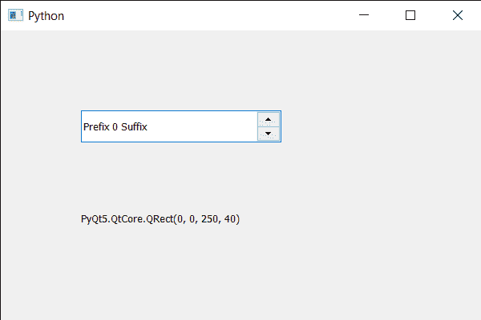

# PyQt5 QSpinBox–获取内容矩形

> 原文:[https://www . geeksforgeeks . org/pyqt 5-qspinbox-get-content-rectangle/](https://www.geeksforgeeks.org/pyqt5-qspinbox-getting-content-rectangle/)

在本文中，我们将看到如何获得旋转框的内容矩形，内容矩形是旋转框边距内的区域。为了得到旋转框的内容矩形，我们对旋转框对象使用`contentsRect`方法。

> **语法:** spin_spin.contentsRect()
> 
> **论证:**不需要论证
> 
> **返回:**返回 QRect 对象

下面是实现

```py
# importing libraries
from PyQt5.QtWidgets import * 
from PyQt5 import QtCore, QtGui
from PyQt5.QtGui import * 
from PyQt5.QtCore import * 
import sys

class Window(QMainWindow):

    def __init__(self):
        super().__init__()

        # setting title
        self.setWindowTitle("Python ")

        # setting geometry
        self.setGeometry(100, 100, 600, 400)

        # calling method
        self.UiComponents()

        # showing all the widgets
        self.show()

        # method for widgets
    def UiComponents(self):
        # creating spin box
        self.spin = QSpinBox(self)

        # setting geometry to spin box
        self.spin.setGeometry(100, 100, 250, 40)

        # setting range to the spin box
        self.spin.setRange(0, 999999)

        # setting prefix to spin
        self.spin.setPrefix("Prefix ")

        # setting suffix to spin
        self.spin.setSuffix(" Suffix")

        # getting the content rectangle
        rectangle = self.spin.contentsRect()

        # creating label
        label = QLabel(self)

        # setting geometry to the label
        label.setGeometry(100, 200, 200, 70)

        # making it multi line label
        label.setWordWrap(True)

        # setting to the label
        label.setText(str(rectangle))

# create pyqt5 app
App = QApplication(sys.argv)

# create the instance of our Window
window = Window()
window.spin.setFocus()
# start the app
sys.exit(App.exec())
```

**输出:**
