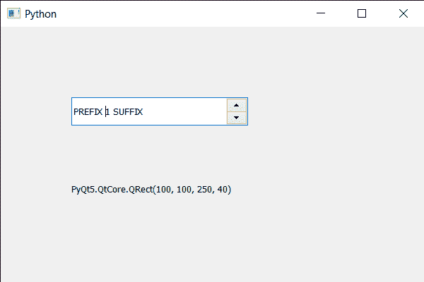

# PyQt5 QSpinBox–获取当前几何图形

> 原文:[https://www . geeksforgeeks . org/pyqt 5-qspinbox-get-current-geometry/](https://www.geeksforgeeks.org/pyqt5-qspinbox-getting-current-geometry/)

在这篇文章中，我们将看到我们如何能够得到自旋盒的当前几何形状。几何基本上是旋转框的位置和大小。将几何体设置到旋转框可以改变其大小和位置。我们使用设置几何方法来设置或更改旋转框的几何。
为了做到这一点，我们对旋转框对象使用几何方法。

> **语法:**font _ metrics . geometry()
> **参数:**不需要参数
> **返回:**返回 QRect 对象

下面是实现

## 蟒蛇 3

```py
# importing libraries
from PyQt5.QtWidgets import *
from PyQt5 import QtCore, QtGui
from PyQt5.QtGui import *
from PyQt5.QtCore import *
import sys

class Window(QMainWindow):

    def __init__(self):
        super().__init__()

        # setting title
        self.setWindowTitle("Python ")

        # setting geometry
        self.setGeometry(100, 100, 600, 400)

        # calling method
        self.UiComponents()

        # showing all the widgets
        self.show()

        # method for widgets
    def UiComponents(self):
        # creating spin box
        self.spin = QSpinBox(self)

        # setting geometry to spin box
        self.spin.setGeometry(100, 100, 250, 40)

        # setting range to the spin box
        self.spin.setRange(1, 999999)

        # setting prefix to spin
        self.spin.setPrefix("PREFIX ")

        # setting suffix to spin
        self.spin.setSuffix(" SUFFIX")

        # creating a label
        label = QLabel(self)

        # making label multi line
        label.setWordWrap(True)

        # setting geometry to the label
        label.setGeometry(100, 200, 300, 60)

        # getting the current geometry
        current_geo = self.spin.geometry()

        # setting text to the label
        label.setText(str(current_geo))

# create pyqt5 app
App = QApplication(sys.argv)

# create the instance of our Window
window = Window()

# start the app
sys.exit(App.exec())
```

**输出:**

