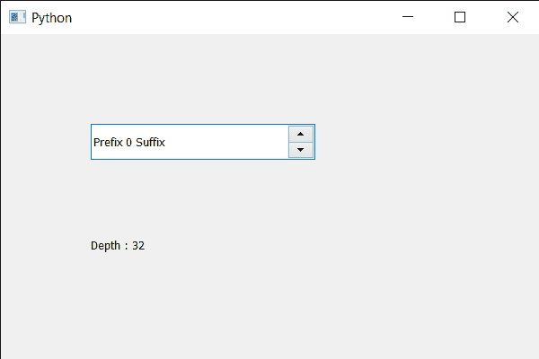

# PyQt5 QSpinBox–获取深度

> 原文:[https://www.geeksforgeeks.org/pyqt5-qspinbox-getting-depth/](https://www.geeksforgeeks.org/pyqt5-qspinbox-getting-depth/)

在本文中，我们将了解如何获得旋转框的深度，颜色深度或颜色深度，也称为位深度，或者是用于指示单个像素颜色的位数，在这个旋转框中，或者是用于单个像素每个颜色分量的位数。

> 为了做到这一点，我们使用深度方法
> 
> **语法:**旋转框深度()
> 
> **论证:**不需要论证
> 
> **返回:**返回整数

下面是实现

```
# importing libraries
from PyQt5.QtWidgets import * 
from PyQt5 import QtCore, QtGui
from PyQt5.QtGui import * 
from PyQt5.QtCore import * 
import sys

class Window(QMainWindow):

    def __init__(self):
        super().__init__()

        # setting title
        self.setWindowTitle("Python ")

        # setting geometry
        self.setGeometry(100, 100, 600, 400)

        # calling method
        self.UiComponents()

        # showing all the widgets
        self.show()

        # method for widgets
    def UiComponents(self):
        # creating spin box
        self.spin = QSpinBox(self)

        # setting geometry to spin box
        self.spin.setGeometry(100, 100, 250, 40)

        # setting range to the spin box
        self.spin.setRange(0, 999999)

        # setting prefix to spin
        self.spin.setPrefix("Prefix ")

        # setting suffix to spin
        self.spin.setSuffix(" Suffix")

        # getting depth
        depth = self.spin.depth()

        # creating label
        label = QLabel(self)

        # setting geometry to the label
        label.setGeometry(100, 200, 200, 70)

        # making it multi line label
        label.setWordWrap(True)

        # setting text to the label
        label.setText("Depth : " + str(depth))

# create pyqt5 app
App = QApplication(sys.argv)

# create the instance of our Window
window = Window()
window.spin.setFocus()
# start the app
sys.exit(App.exec())
```

**输出:**
