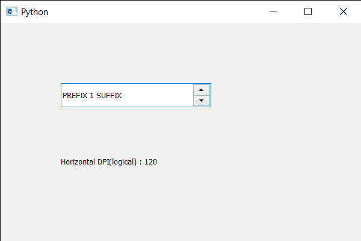

# PyQt5 QSpinBox–获取水平逻辑 DPI 值

> 原文:[https://www . geeksforgeeks . org/pyqt 5-qspinbox-get-horizontal-logic-dpi-value/](https://www.geeksforgeeks.org/pyqt5-qspinbox-getting-horizontal-logical-dpi-value/)

在本文中，我们将了解如何通过旋转框的每英寸点数(DPI)获得设备的水平分辨率。每英寸逻辑点用于将字体和用户界面元素从点大小转换为像素大小，可能与每英寸物理点不同。

**注意:**如果水平逻辑 DPI 不等于物理水平 DPI，那么相应的 QPaintEngine 必须处理分辨率映射。

为了做到这一点，我们对旋转框对象使用`logicalDpiX`方法。

> **语法:** spin_box.logicalDpiX()
> 
> **论证:**不需要论证
> 
> **返回:**返回整数

下面是实现

```py
# importing libraries
from PyQt5.QtWidgets import * 
from PyQt5 import QtCore, QtGui
from PyQt5.QtGui import * 
from PyQt5.QtCore import * 
import sys

class Window(QMainWindow):

    def __init__(self):
        super().__init__()

        # setting title
        self.setWindowTitle("Python ")

        # setting geometry
        self.setGeometry(100, 100, 600, 400)

        # calling method
        self.UiComponents()

        # showing all the widgets
        self.show()

        # method for widgets
    def UiComponents(self):
        # creating spin box
        self.spin = QSpinBox(self)

        # setting geometry to spin box
        self.spin.setGeometry(100, 100, 250, 40)

        # setting range to the spin box
        self.spin.setRange(1, 999999)

        # setting prefix to spin
        self.spin.setPrefix("PREFIX ")

        # setting suffix to spin
        self.spin.setSuffix(" SUFFIX")

        # creating a label
        label = QLabel(self)

        # making the label multi line
        label.setWordWrap(True)

        # setting geometry to the label
        label.setGeometry(100, 200, 200, 60)

        # getting the horizontal logical dpi value
        value = self.spin.logicalDpiX()

        # setting text to the label
        label.setText("Horizontal DPI(logical) : " + str(value))

# create pyqt5 app
App = QApplication(sys.argv)

# create the instance of our Window
window = Window()

# start the app
sys.exit(App.exec())
```

**输出:**
