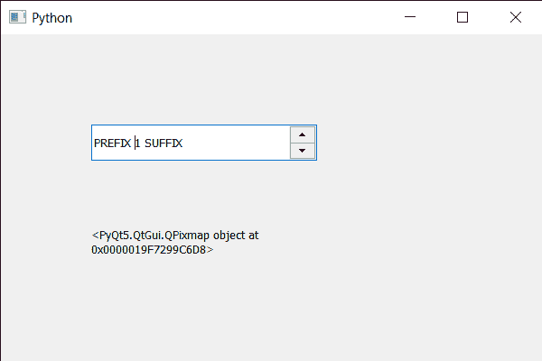

# PyQt5 QSpinBox–从中获取位图

> 原文:[https://www . geesforgeks . org/pyqt5-qspinbox-get-pixmap-from-it/](https://www.geeksforgeeks.org/pyqt5-qspinbox-getting-pixmap-from-it/)

在这篇文章中，我们将看到我们如何能得到受旋转框限制的位图。如果旋转框有任何子对象，那么它们也会被绘制在适当的位置。

**注意:**这个函数可以通过元对象系统从 QML 调用。

为了做到这一点，我们对旋转框对象使用`grab`方法。

> **语法:**旋转框抓取(矩形)
> 
> **自变量:**它以 QRect 对象为自变量
> 
> **返回:**返回 QPixmap 对象

下面是实现

```
# importing libraries
from PyQt5.QtWidgets import * 
from PyQt5 import QtCore, QtGui
from PyQt5.QtGui import * 
from PyQt5.QtCore import * 
import sys

class Window(QMainWindow):

    def __init__(self):
        super().__init__()

        # setting title
        self.setWindowTitle("Python ")

        # setting geometry
        self.setGeometry(100, 100, 600, 400)

        # calling method
        self.UiComponents()

        # showing all the widgets
        self.show()

        # method for widgets
    def UiComponents(self):
        # creating spin box
        self.spin = QSpinBox(self)

        # setting geometry to spin box
        self.spin.setGeometry(100, 100, 250, 40)

        # setting range to the spin box
        self.spin.setRange(1, 999999)

        # setting prefix to spin
        self.spin.setPrefix("PREFIX ")

        # setting suffix to spin
        self.spin.setSuffix(" SUFFIX")

        # creating a label
        label = QLabel(self)

        # making label multi line
        label.setWordWrap(True)

        # setting geometry to the label
        label.setGeometry(100, 200, 300, 60)

        # getting the current geometry
        geometry = self.spin.geometry()

        # getting the pixmap from the spin box
        pixmap = self.spin.grab(geometry)

        # setting text to the label
        label.setText(str(pixmap))

# create pyqt5 app
App = QApplication(sys.argv)

# create the instance of our Window
window = Window()

# start the app
sys.exit(App.exec())
```

**输出:**
