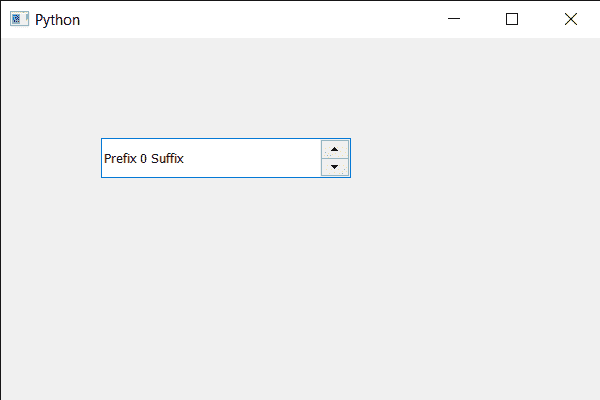

# PyQt5 QSpinBox–获取系统标识符

> 原文:[https://www . geeksforgeeks . org/pyqt 5-qspinbox-get-system-identifier/](https://www.geeksforgeeks.org/pyqt5-qspinbox-getting-system-identifier/)

在本文中，我们将看到如何获得旋转框的有效窗口系统标识符。有效标识符是指旋转框的本地父窗口系统标识符。

> 为了做到这一点，我们使用了有效的方法
> 
> **语法:**自旋 _ box.effectiveWinId()
> 
> **论证:**不需要论证
> 
> **返回:**如果旋转框是原生的，这个函数返回原生的小部件 ID。否则，将返回第一个原生父小部件(即包含此旋转框的顶级小部件)的窗口标识。

**注意:**此方法应在主窗口打开后即主窗口类外调用

下面是实现

```
# importing libraries
from PyQt5.QtWidgets import * 
from PyQt5 import QtCore, QtGui
from PyQt5.QtGui import * 
from PyQt5.QtCore import * 
import sys

class Window(QMainWindow):

    def __init__(self):
        super().__init__()

        # setting title
        self.setWindowTitle("Python ")

        # setting geometry
        self.setGeometry(100, 100, 600, 400)

        # calling method
        self.UiComponents()

        # showing all the widgets
        self.show()

        # method for widgets
    def UiComponents(self):
        # creating spin box
        self.spin = QSpinBox(self)

        # setting geometry to spin box
        self.spin.setGeometry(100, 100, 250, 40)

        # setting range to the spin box
        self.spin.setRange(0, 999999)

        # setting prefix to spin
        self.spin.setPrefix("Prefix ")

        # setting suffix to spin
        self.spin.setSuffix(" Suffix")

# create pyqt5 app
App = QApplication(sys.argv)

# create the instance of our Window
window = Window()

# getting system identifier of spin box
identifier = window.spin.effectiveWinId()

# print the identifier
print(identifier)

# start the app
sys.exit(App.exec())
```

**输出:**

```
sip.voidptr object at 0x000002A982EED690
```

