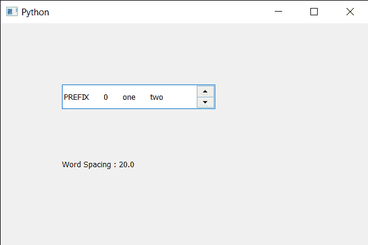

# PyQt5 QSpinBox–获取单词间距

> 原文:[https://www . geeksforgeeks . org/pyqt 5-qspinbox-get-word-spacing/](https://www.geeksforgeeks.org/pyqt5-qspinbox-getting-word-spacing/)

在本文中，我们将看到如何在旋转框的文本中获得单词间距。单词是一组由其他字母用空格隔开的单个字母，单词间距会增加它们之间的空格。我们可以借助`setWordSpacing`方法设置单词间距。

**注意:**将间距设置为较低的值不能减小间距。

为了做到这一点，我们对旋转框的 QFont 对象使用`wordSpacing`方法。

> **语法:**font . words pace()
> 
> **论证:**不需要论证
> 
> **返回:**返回浮动

下面是实现

```py
# importing libraries
from PyQt5.QtWidgets import * 
from PyQt5 import QtCore, QtGui
from PyQt5.QtGui import * 
from PyQt5.QtCore import * 
import sys

class Window(QMainWindow):

    def __init__(self):
        super().__init__()

        # setting title
        self.setWindowTitle("Python ")

        # setting geometry
        self.setGeometry(100, 100, 600, 400)

        # calling method
        self.UiComponents()

        # showing all the widgets
        self.show()

        # method for widgets
    def UiComponents(self):
        # creating spin box
        self.spin = QSpinBox(self)

        # setting geometry to spin box
        self.spin.setGeometry(100, 100, 250, 40)

        # setting range to the spin box
        self.spin.setRange(0, 999999)

        # setting prefix to spin
        self.spin.setPrefix("PREFIX ")

        # setting suffix to spin
        self.spin.setSuffix(" one two")

        # getting font of the spin box
        font = self.spin.font()

        # setting word spacing
        font.setWordSpacing(20)

        # reassigning this font to the spin box
        self.spin.setFont(font)

        # creating a label
        label = QLabel(self)

        # setting geometry to the label
        label.setGeometry(100, 200, 300, 60)

        # getting word spacing
        check = font.wordSpacing()

        # setting text to the label
        label.setText("Word Spacing : " + str(check))

# create pyqt5 app
App = QApplication(sys.argv)

# create the instance of our Window
window = Window()

# start the app
sys.exit(App.exec())
```

**输出:**
