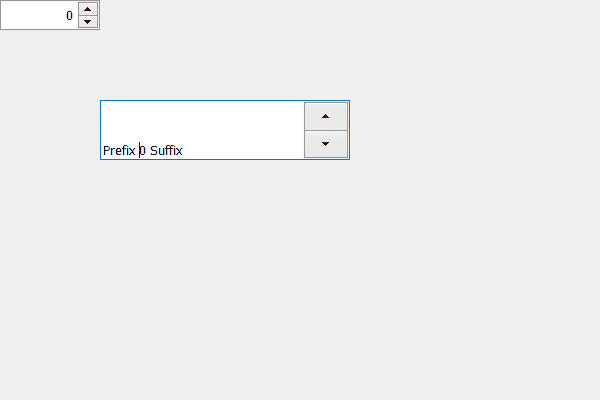

# PyQt5 QSpinBox–设置对齐方式

> 原文:[https://www . geesforgeks . org/pyqt 5-qspinbox-setting-alignment/](https://www.geeksforgeeks.org/pyqt5-qspinbox-setting-alignment/)

在本文中，我们将看到如何设置旋转框的对齐方式，默认情况下，旋转框文本是左对齐的。虽然我们可以更改它，但旋转框有许多对齐方式。旋转箱有很多校准标志。

下面是对齐标志列表

```py
Qt.AlignLeft    
Qt.AlignRight    
Qt.AlignHCenter    
Qt.AlignJustify
Qt.AlignTop    
Qt.AlignBottom    
Qt.AlignVCenter    
Qt.AlignBaseline
Qt.AlignCenter
Qt.AlignAbsolute    
Qt.AlignLeading
Qt.AlignTrailing

```

为了将这些对齐标志设置到旋转框中，我们使用了设置对齐方法。

> **语法:**旋转框.设置对齐(对齐标志)
> 
> **参数:**以对齐标志为参数
> 
> **执行的操作:**它设置与旋转框的对齐。

下面是实现

```py
# importing libraries
from PyQt5.QtWidgets import * 
from PyQt5 import QtCore, QtGui
from PyQt5.QtGui import * 
from PyQt5.QtCore import * 
import sys

class Window(QMainWindow):

    def __init__(self):
        super().__init__()

        # setting title
        self.setWindowTitle("Python ")

        # setting geometry
        self.setGeometry(100, 100, 600, 400)

        # calling method
        self.UiComponents()

        # showing all the widgets
        self.show()

    # method for widgets
    def UiComponents(self):
        # creating spin box
        self.spin = QSpinBox(self)

        # setting geometry to spin box
        self.spin.setGeometry(100, 100, 250, 60)

        # setting prefix to spin
        self.spin.setPrefix("Prefix ")

        # setting suffix to spin
        self.spin.setSuffix(" Suffix")

        # alignment flag
        alignment_flag = Qt.AlignBottom

        # setting alignment to the spin box
        self.spin.setAlignment(alignment_flag)

        # creating another spin box
        spinbox = QSpinBox(self)

        # setting alignment to the spinbox
        spinbox.setAlignment(Qt.AlignRight)

# create pyqt5 app
App = QApplication(sys.argv)

# create the instance of our Window
window = Window()

# start the app
sys.exit(App.exec())
```

**输出:**
