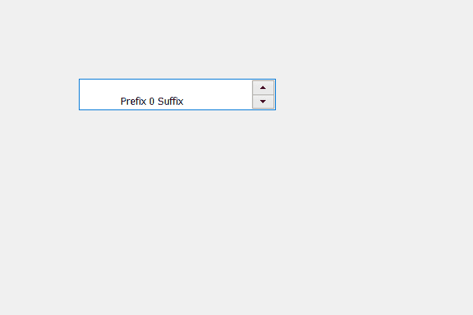

# PyQt5 QSpinBox–设置边距

> 原文:[https://www . geesforgeks . org/pyqt 5-qspinbox-setting-margin/](https://www.geeksforgeeks.org/pyqt5-qspinbox-setting-margin/)

在本文中，我们将了解如何为旋转框设置边距，默认情况下，没有为旋转框设置边距，即它们的边距值为零。虽然我们可以改变这一点，但是将边距设置为数字显示框将不会显示数字显示框中的任何变化，因为小部件会进行覆盖以保持其结构。但是为了给旋转框设置边距，我们给旋转框的线编辑对象设置了边距，通过它我们可以在旋转框中显示边距。

为此，我们使用 **setContentsMargins** 方法。

> **语法:**line_edit . setcontentsmargins(左、上、右、下)
> 这里 line _ edit 是旋转框的 QLineEdit 对象
> 
> **自变量:**取四个整数作为自变量
> 
> **返回:**返回无

下面是实现

```py
# importing libraries
from PyQt5.QtWidgets import * 
from PyQt5 import QtCore, QtGui
from PyQt5.QtGui import * 
from PyQt5.QtCore import * 
import sys

class Window(QMainWindow):

    def __init__(self):
        super().__init__()

        # setting title
        self.setWindowTitle("Python ")

        # setting geometry
        self.setGeometry(100, 100, 600, 400)

        # calling method
        self.UiComponents()

        # showing all the widgets
        self.show()

        # method for widgets
    def UiComponents(self):
        # creating spin box
        self.spin = QSpinBox(self)

        # setting geometry to spin box
        self.spin.setGeometry(100, 100, 250, 40)

        # setting range to the spin box
        self.spin.setRange(0, 999999)

        # setting prefix to spin
        self.spin.setPrefix("Prefix ")

        # setting suffix to spin
        self.spin.setSuffix(" Suffix")

        # getting line edit object
        line_edit = self.spin.lineEdit()

        # setting margin to the line edit
        line_edit.setContentsMargins(50, 20, 5, 5)

# create pyqt5 app
App = QApplication(sys.argv)

# create the instance of our Window
window = Window()
window.spin.setFocus()
# start the app
sys.exit(App.exec())
```

**输出:**
