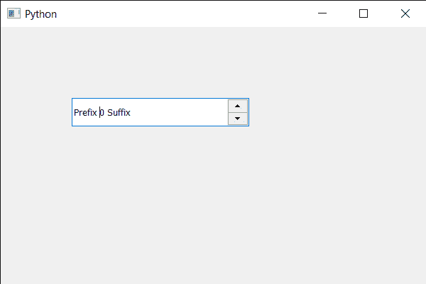

# PyQt5 QSpinBox–设置属性

> 原文:[https://www . geeksforgeeks . org/pyqt 5-qspinbox-setting-properties/](https://www.geeksforgeeks.org/pyqt5-qspinbox-setting-properties/)

在本文中，我们将看到如何为旋转框设置属性，属性是开发人员添加的信息，用于说明旋转框的属性，例如，如果旋转框能够循环值，开发人员将添加该属性，以便其他开发人员可以看到该属性并了解该属性。

> 为此，我们使用了 setProperty 方法
> 
> **语法:**自旋 _box.setProperty(属性，值)
> 
> **参数:**需要两个参数，一个是字符串，另一个是整数
> 
> **执行的操作:**将该属性添加到旋转框中

下面是实现

```py
# importing libraries
from PyQt5.QtWidgets import * 
from PyQt5 import QtCore, QtGui
from PyQt5.QtGui import * 
from PyQt5.QtCore import * 
import sys

class Window(QMainWindow):

    def __init__(self):
        super().__init__()

        # setting title
        self.setWindowTitle("Python ")

        # setting geometry
        self.setGeometry(100, 100, 600, 400)

        # calling method
        self.UiComponents()

        # showing all the widgets
        self.show()

        # method for widgets
    def UiComponents(self):
        # creating spin box
        self.spin = QSpinBox(self)

        # setting geometry to spin box
        self.spin.setGeometry(100, 100, 250, 40)

        # setting range to the spin box
        self.spin.setRange(0, 999999)

        # setting prefix to spin
        self.spin.setPrefix("Prefix ")

        # setting suffix to spin
        self.spin.setSuffix(" Suffix")

        # adding property to the spin box
        self.spin.setProperty("Dynamic", 1)

        # adding property to the spin box
        self.spin.setProperty("Has suffix", 1)

# create pyqt5 app
App = QApplication(sys.argv)

# create the instance of our Window
window = Window()
window.spin.setFocus()
# start the app
sys.exit(App.exec())
```

**输出:**
