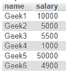
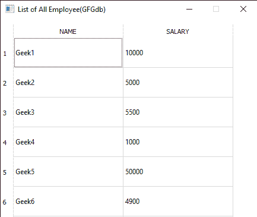

# pyqt 5 qtsql–python

> 哎哎哎::1230【https://www . geeksforgeeks . org/pyqt 5-qtsql-python/

PyQt 为我们提供了用户界面功能，这些功能在使用 PyQt 的所有功能和小部件构建应用程序的许多方面都很有用。此外，PyQt 为我们在应用程序中集成数据库提供了便利。我们可以通过它集成任何数据库，其中一些是- MySQL，SQLITE 等。

使用 **QtSql** 模块将 SQL 数据库与 PyQt5 应用程序链接。SQL 类分为三层:
1。**驱动层:**有*qsqldriverreatorbase，QSqlResult* 类。
2。 **SQL API 层:**这些提供对数据库的访问。连接使用 *QSqlDatabase* ，与数据库的交互由 *QSqlQuery* 类完成。
3。**用户界面层:**这些与 Qt 的模型框架一起工作。其中有 *QSqlQueryModel、QSqlTableModel* 等。

要导入模块，请使用以下命令:

```
 from PyQt5 import QtSql

```

**用于连接数据库**

```
self.QSqlDatabase.addDatabase("QMYSQL")
self.db.setHostName("geeksforgeeks")
self.db.setDatabaseName("gfgdb")
self.db.setUserName("geeks")
self.db.setPassword("gfg")

```

第一个参数 *QSqlDatabase.addDatabase* 用于添加驱动程序(如 QPSQL、QMYSQL、QOCI、QODBC、QSQLITE 等)。接下来的四个命令*设置主机名()，设置数据库名()，设置用户名()，以及设置口令()*初始化数据库连接。*一旦数据库被初始化，就调用 QSqlDatabase.open()* 来打开并访问它。

**执行 MySQL 查询**

```
self.qry = QString("SELECT * FROM employee")
self.query = QSqlQuery()
self.query.prepare(self.qry)
self.query.exec()

```

QSqlQuery 类提供 *exec()* 方法来执行查询。

现在，为了以表格的形式**获取结果**，使用以下代码序列:

```
for row_number, row_data in enumerate(self.query.result()):
      for column_number, data in enumerate(row_data):
           self.tableWidget.setItem(row_number, column_number, QtWidgets.QTableWidgetItem(data)

```

下面只显示了一种类型的查询，但是同样的**插入、删除、更新**查询也可以执行，你只需要替换 *self.qry* 变量中的查询。数据库命名 *gfgdb* 应该有一个表命名员工。

[](https://media.geeksforgeeks.org/wp-content/uploads/20191208164200/Capture270.png)

**示例:**

```
# Write Python3 code here
import sys
from PyQt5 import QtCore, QtGui, QtWidgets, QtSql

class Ui_MainWindow(object): have 

    def setupUi(self, MainWindow):
        # Setting mainwindow
        MainWindow.setObjectName("MainWindow")
        MainWindow.resize(432, 813)
        MainWindow.setMinimumSize(QtCore.QSize(432, 813))
        MainWindow.setMaximumSize(QtCore.QSize(432, 813))

        self.centralwidget = QtWidgets.QWidget(MainWindow)
        self.centralwidget.setObjectName("centralwidget")
        self.frame = QtWidgets.QFrame(self.centralwidget)
        self.frame.setGeometry(QtCore.QRect(0, 0, 781, 821))

        self.frame.setFrameShape(QtWidgets.QFrame.StyledPanel)
        self.frame.setFrameShadow(QtWidgets.QFrame.Raised)
        self.frame.setObjectName("frame")

        # setting up the output table
        self.tableWidget = QtWidgets.QTableWidget(self.frame)
        self.tableWidget.setGeometry(QtCore.QRect(0, 10, 431, 731))
        self.tableWidget.setRowCount(10)
        self.tableWidget.setColumnCount(2)
        self.tableWidget.setObjectName("tableWidget")

        # initializing items to be added in the table
        item = QtWidgets.QTableWidgetItem()
        item1 = QtWidgets.QTableWidgetItem()
        # inserting above items to the table
        self.tableWidget.setHorizontalHeaderItem(0, item)
        self.tableWidget.setHorizontalHeaderItem(1, item1)
        self.tableWidget.horizontalHeader().setDefaultSectionSize(185)
        self.tableWidget.verticalHeader().setMinimumSectionSize(50)
        MainWindow.setCentralWidget(self.centralwidget)

        self.retranslateUi(MainWindow)
        QtCore.QMetaObject.connectSlotsByName(MainWindow)

        # connection to the database
        self.QSqlDatabase.addDatabase("QMYSQL")
        self.db.setHostName("geeksforgeeks")
        self.db.setDatabaseName("gfgdb")
        self.db.setUserName("geeks")
        self.db.setPassword("gfg")
        # executing MySql query
        self.qry = QString("SELECT * FROM employee")
        self.query = QSqlQuery()
        self.query.prepare(self.qry)
        self.query.exec()

        # displaying output of query in the table
        for row_number, row_data in enumerate(self.query.result()):
            for column_number, data in enumerate(row_data):
                self.tableWidget.setItem(row_number, column_number, QtWidgets.QTableWidgetItem(data) 

    def retranslateUi(self, MainWindow):
        _translate = QtCore.QCoreApplication.translate
        MainWindow.setWindowTitle(_translate("MainWindow", "List of All Employee(GFGdb)"))
        item = self.tableWidget.horizontalHeaderItem(0)
        item.setText(_translate("MainWindow", "NAME"))
        item1 = self.tableWidget.horizontalHeaderItem(1)
        item1.setText(_translate("MainWindow", "SALARY"))

if __name__ == "__main__":

    import sys
    app = QtWidgets.QApplication(sys.argv)
    MainWindow = QtWidgets.QMainWindow()
    ui = Ui_MainWindow()
    ui.setupUi(MainWindow)
    MainWindow.show()
    sys.exit(app.exec_())
```

**输出:**
[](https://media.geeksforgeeks.org/wp-content/uploads/20191208170931/gfgdb.png)