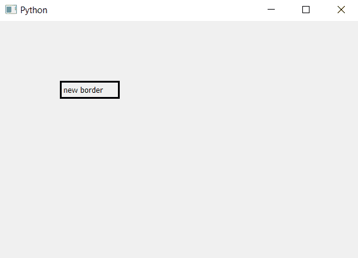

# PyQt5–rect()方法

> 原文:[https://www.geeksforgeeks.org/pyqt5-rect-method/](https://www.geeksforgeeks.org/pyqt5-rect-method/)

`rect()`方法属于`QtCore.QRect class`，该方法用于获取窗口或任意小部件的几何图形。它返回类型为`QRect`的对象，该对象表示矩形的属性。

> **语法 ：** widget.rect（）
> 
> **论证:**不需要论证。
> 
> **返回:**返回小部件的矩形

**代码:**

```py
# importing the required libraries

from PyQt5.QtCore import * 
from PyQt5.QtGui import * 
from PyQt5.QtWidgets import * 
import sys

class Window(QMainWindow):
    def __init__(self):
        super().__init__()

        # set the title
        self.setWindowTitle("Python")

        # setting geometry
        self.setGeometry(100, 100, 600, 400)

        # creating a label widget
        self.label_1 = QLabel("new border ", self)

        # moving position
        self.label_1.move(100, 100)

        # printing window geometry
        print(self.rect())

        # printing label geometry
        print(self.label_1.rect())

        # setting up the border
        self.label_1.setStyleSheet("border :3px solid black;")

        # show all the widgets
        self.update()
        self.show()

# create pyqt5 app
App = QApplication(sys.argv)

# create the instance of our Window
window = Window()

# start the app
sys.exit(App.exec())
```

**输出:**

```py
PyQt5.QtCore.QRect(0, 0, 600, 400)
PyQt5.QtCore.QRect(0, 0, 100, 30)

```

