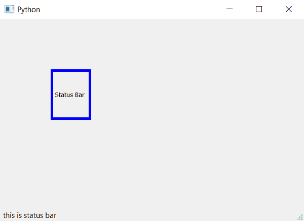

# PyQt5–在窗口

中设置状态栏消息

> 原文:[https://www . geesforgeks . org/pyqt 5-set-状态栏-窗口中的消息/](https://www.geeksforgeeks.org/pyqt5-set-status-bar-message-in-window/)

在本文中，我们将看到如何设置消息到窗口的状态栏。一个**状态栏**是一个图形控制元素，它构成了一个通常位于窗口底部的信息区域。它可以分成几个部分来分组信息。它的工作主要是显示窗口当前状态的信息。

为了做到这一点，我们将使用`showMessage()`方法。

> **语法:** self.statusBar()。显示消息(消息)
> 
> **自变量:**它以字符串为自变量。
> 
> **执行的操作:**将消息设置为状态栏。

**代码:**

```
from PyQt5.QtCore import * 
from PyQt5.QtGui import * 
from PyQt5.QtWidgets import * 
import sys

class Window(QMainWindow):
    def __init__(self):
        super().__init__()

        # set the title
        self.setWindowTitle("Python")

        # setting  the geometry of window
        self.setGeometry(60, 60, 600, 400)

        # setting status bar message
        self.statusBar().showMessage("this is status bar")

        # creating a label widget
        self.label_1 = QLabel("Status Bar", self)

        # moving position
        self.label_1.move(100, 100)

        # setting up the border
        self.label_1.setStyleSheet("border :5px solid blue;")

        # resizing label
        self.label_1.resize(80, 100)

        # show all the widgets
        self.show()

# create pyqt5 app
App = QApplication(sys.argv)

# create the instance of our Window
window = Window()

# start the app
sys.exit(App.exec())
```

**输出:**
