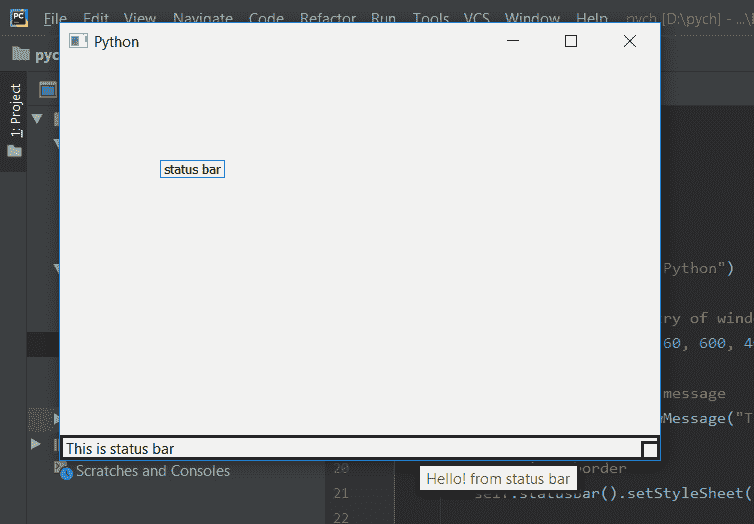

# PyQt5–将工具提示设置为状态栏

> 原文:[https://www . geesforgeks . org/pyqt 5-set-tool-tip-to-status-bar/](https://www.geeksforgeeks.org/pyqt5-set-tool-tip-to-status-bar/)

在本文中，我们将了解如何将工具提示设置为状态栏。**工具提示**或信息提示或提示是常见的图形用户界面元素。它与光标(通常是指针)结合使用。用户将指针悬停在某个项目上，而不单击它，可能会出现一个工具提示—一个小的“悬停框”，其中包含有关该项目的信息。

为了设置这个，我们将使用带有状态栏对象的`setToolTip`方法。

> **语法:** self.statusBar()。设置工具提示(数据)
> 
> **自变量:**它以字符串为自变量。
> 
> **执行的操作:**将工具提示设置为状态栏。

**代码:**

```
from PyQt5.QtCore import * 
from PyQt5.QtGui import * 
from PyQt5.QtWidgets import * 
import sys

class Window(QMainWindow):
    def __init__(self):
        super().__init__()

        # set the title
        self.setWindowTitle("Python")

        # setting  the geometry of window
        self.setGeometry(60, 60, 600, 400)

        # setting status bar message
        self.statusBar().showMessage("This is status bar")

        # setting  border
        self.statusBar().setStyleSheet("border :3px solid black;")

        # setting tool tip for status bar
        self.statusBar().setToolTip("Hello ! from status bar")

        # creating a label widget
        self.label_1 = QLabel("status bar", self)

        # moving position
        self.label_1.move(100, 100)

        # setting up the border
        self.label_1.setStyleSheet("border :1px solid blue;")

        # resizing label
        self.label_1.adjustSize()

        # show all the widgets
        self.show()

# create pyqt5 app
App = QApplication(sys.argv)

# create the instance of our Window
window = Window()

# start the app
sys.exit(App.exec())
```

**输出:**
