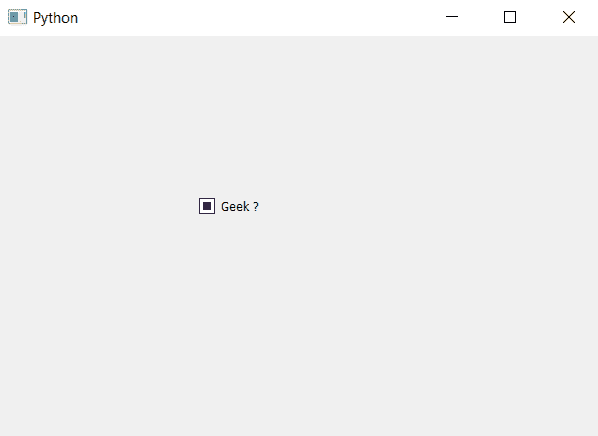

# PyQt5–复选框

的设置检查状态()方法

> 原文:[https://www . geeksforgeeks . org/pyqt5-setcheckstate-method-for-check-box/](https://www.geeksforgeeks.org/pyqt5-setcheckstate-method-for-check-box/)

当我们创建一个复选框时，它只有选中和未选中两种状态，尽管我们可以使用`setTristate`方法添加一个中间状态。我们可以使用`setChecked`将复选框设置为选中或未选中，但这种方法无法将复选框设置为中间状态。

`setCheckState`方法用于设置复选框的状态，它可以被选中或取消选中，甚至可以设置中间状态，它以 CheckState 对象作为参数。

> **语法:**复选框。设置检查状态(1)
> 
> **自变量:**它以 CheckState 对象为自变量。
> 
> **执行的操作:**
> 如果我们将 0 传递给它，它将未选中状态设置为复选框
> 如果我们将 1 传递给它，它将中间状态设置为复选框
> 如果我们将任何其他整数传递给它，它将选中状态设置为复选框

下面是实现。

```py
# importing libraries
from PyQt5.QtWidgets import * 
from PyQt5 import QtCore, QtGui
from PyQt5.QtGui import * 
from PyQt5.QtCore import * 
import sys

class Window(QMainWindow):

    def __init__(self):
        super().__init__()

        # setting title
        self.setWindowTitle("Python ")

        # setting geometry
        self.setGeometry(100, 100, 600, 400)

        # calling method
        self.UiComponents()

        # showing all the widgets
        self.show()

    # method for widgets
    def UiComponents(self):

        # creating the check-box
        checkbox = QCheckBox('Geek ?', self)

        # setting geometry of check box
        checkbox.setGeometry(200, 150, 100, 40)

        # making check box as tristate
        checkbox.setTristate(True)

        # setting check box state
        checkbox.setCheckState(1)

# create pyqt5 app
App = QApplication(sys.argv)

# create the instance of our Window
window = Window()

# start the app
sys.exit(App.exec())
```

**输出:**
