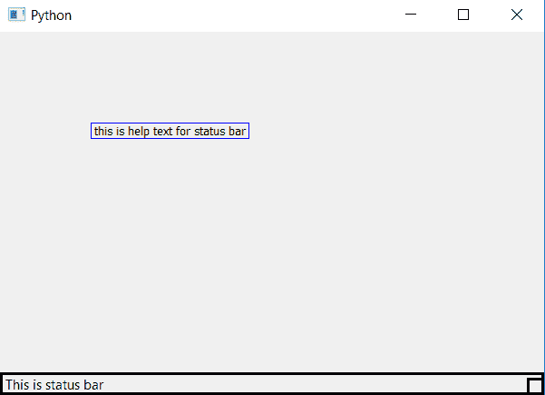

# PyQt5–设置和访问状态栏的帮助文本

> 原文:[https://www . geesforgeks . org/pyqt 5-设置和访问-这是什么-帮助-状态栏文本/](https://www.geeksforgeeks.org/pyqt5-setting-and-accessing-whats-this-help-text-for-status-bar/)

n PyQt5 有许多小部件和栏，当我们倾向于制作一个应用程序时，我们最终会放入许多窗口，每个窗口都有退出状态栏。有时候我们想不起来为什么用这个状态栏，这个状态栏是什么。这就是为什么为了后端的目的，PyQt5 允许我们设置帮助文本。在本文中，我们将看到如何设置和访问状态栏的帮助文本。

为了设置帮助文本，我们使用`setWhatsThis()`方法，为了访问帮助文本，我们使用`whatsThis()`方法。

> **语法:**
> 
> ```py
> self.statusBar().setWhatsThis()
> self.statusBar().whatsThis()
> 
> ```
> 
> **论证:**
> 以弦为论证。
> `whatsThis()`无需争论。
> 
> **返回:**
> 返回无
> `whatsThis()`返回字符串。

**代码:**

```py
from PyQt5.QtCore import * 
from PyQt5.QtGui import * 
from PyQt5.QtWidgets import * 
import sys

class Window(QMainWindow):
    def __init__(self):
        super().__init__()

        # set the title
        self.setWindowTitle("Python")

        # setting  the geometry of window
        self.setGeometry(60, 60, 600, 400)

        # setting status bar message
        self.statusBar().showMessage("This is status bar")

        # setting  border
        self.statusBar().setStyleSheet("border :3px solid black;")

        # setting help text
        self.statusBar().setWhatsThis("this is help text for status bar")

        # creating a label widget
        self.label_1 = QLabel(self)

        # moving position
        self.label_1.move(100, 100)

        # setting up the border
        self.label_1.setStyleSheet("border :1px solid blue;")

        # accessing help text of status bar
        help = self.statusBar().whatsThis()

        # setting text to label
        self.label_1.setText(help)

        # resizing label
        self.label_1.adjustSize()

        # show all the widgets
        self.show()

# create pyqt5 app
App = QApplication(sys.argv)

# create the instance of our Window
window = Window()

# start the app
sys.exit(App.exec())
```

**输出:**
