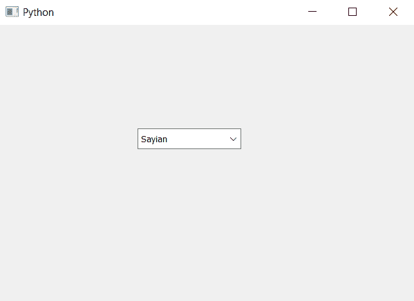

# PyQt5–设置组合框描述|设置访问描述方法

> 原文:[https://www . geeksforgeeks . org/pyqt 5-设置-组合框-描述-setaccessibledescription-方法/](https://www.geeksforgeeks.org/pyqt5-setting-combo-box-description-setaccessibledescription-method/)

在本文中，我们将看到如何设置组合框的描述。描述是关于组合框的详细信息，它讲述了功能用例和其他主要信息来理解组合框的工作。

为了给组合框设置描述，我们使用`setAccessibleDescription`方法

> **语法:**组合框. setAccessibleDescription(文本)
> 
> **自变量:**以字符串为自变量
> 
> **返回:**无

以下是实施–

```py
# importing libraries
from PyQt5.QtWidgets import * 
from PyQt5 import QtCore, QtGui
from PyQt5.QtGui import * 
from PyQt5.QtCore import * 
import sys

class Window(QMainWindow):

    def __init__(self):
        super().__init__()

        # setting title
        self.setWindowTitle("Python ")

        # setting geometry
        self.setGeometry(100, 100, 600, 400)

        # calling method
        self.UiComponents()

        # showing all the widgets
        self.show()

    # method for widgets
    def UiComponents(self):

        # creating a combo box widget
        self.combo_box = QComboBox(self)

        # setting geometry of combo box
        self.combo_box.setGeometry(200, 150, 150, 30)

        # geek list
        geek_list = ["Sayian", "Super Saiyan", "Super Sayian 2", "Super Sayian B"]

        # making it editable
        self.combo_box.setEditable(True)

        # adding list of items to combo box
        self.combo_box.addItems(geek_list)

        # description text
        text = " This is a description of the combo box "

        # setting description to the combo box
        self.combo_box.setAccessibleDescription(text)

# create pyqt5 app
App = QApplication(sys.argv)

# create the instance of our Window
window = Window()

# start the app
sys.exit(App.exec())
```

**输出:**
