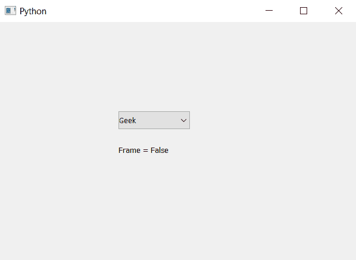

# PyQt5–设置/禁用组合框

> 原文:[https://www . geeksforgeeks . org/pyqt 5-设置-禁用组合框/](https://www.geeksforgeeks.org/pyqt5-setting-disabling-the-frame-of-combobox/)

在本文中，我们将看到如何设置或禁用组合框的框架。默认情况下，当我们创建一个组合框，它有框架，虽然我们可以改变它。为了设置或禁用帧，我们使用`setFrame`方法。

> **语法:**组合框.设置框架(假)
> 
> **自变量:**它以布尔为自变量
> 
> **执行的操作:**将禁用复选框的框架

以下是实施–

```
# importing libraries
from PyQt5.QtWidgets import * 
from PyQt5 import QtCore, QtGui
from PyQt5.QtGui import * 
from PyQt5.QtCore import * 
import sys

class Window(QMainWindow):

    def __init__(self):
        super().__init__()

        # setting title
        self.setWindowTitle("Python ")

        # setting geometry
        self.setGeometry(100, 100, 600, 400)

        # calling method
        self.UiComponents()

        # showing all the widgets
        self.show()

    # method for widgets
    def UiComponents(self):

        # creating a combo box widget
        self.combo_box = QComboBox(self)

        # setting geometry of combo box
        self.combo_box.setGeometry(200, 150, 120, 30)

        # geek list
        geek_list = ["Geek", "Geeky Geek", "Legend Geek", "Ultra Legend Geek"]

        # adding list of items to combo box
        self.combo_box.addItems(geek_list)

        # disabling the frame
        self.combo_box.setFrame(False)

        # finding if combo box is having frame or not
        check = self.combo_box.hasFrame()

        # creating label to show check
        label = QLabel("Frame = " + str(check), self)

        # setting geometry of label
        label.setGeometry(200, 200, 200, 30)

# create pyqt5 app
App = QApplication(sys.argv)

# create the instance of our Window
window = Window()

# start the app
sys.exit(App.exec())
```

**输出:**
