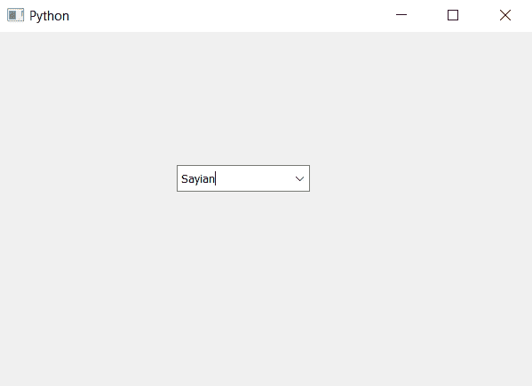

# PyQt5–组合框的设置名称

> 原文:[https://www . geesforgeks . org/pyqt 5-设置-组合框名称/](https://www.geeksforgeeks.org/pyqt5-setting-name-of-combo-box/)

在本文中，我们将看到如何为组合框设置名称，名称基本上用于区分组合框，程序员可以根据组合框的用途为其命名，这样它们就可以很容易区分，默认情况下不会给组合框命名。为了设置名称，我们使用`setAccessibleName`方法。

> **语法:**组合框. setAccessibleName(名称)
> 
> **自变量:**以字符串为自变量
> 
> **返回:**无

以下是实施–

```py
# importing libraries
from PyQt5.QtWidgets import * 
from PyQt5 import QtCore, QtGui
from PyQt5.QtGui import * 
from PyQt5.QtCore import * 
import sys

class Window(QMainWindow):

    def __init__(self):
        super().__init__()

        # setting title
        self.setWindowTitle("Python ")

        # setting geometry
        self.setGeometry(100, 100, 600, 400)

        # calling method
        self.UiComponents()

        # showing all the widgets
        self.show()

    # method for widgets
    def UiComponents(self):

        # creating a combo box widget
        self.combo_box = QComboBox(self)

        # setting geometry of combo box
        self.combo_box.setGeometry(200, 150, 150, 30)

        # geek list
        geek_list = ["Sayian", "Super Sayian"]

        # making it editable
        self.combo_box.setEditable(True)

        # adding list of items to combo box
        self.combo_box.addItems(geek_list)

        # name
        name = "Sayian Combo box"

        # setting name to the combo box
        self.combo_box.setAccessibleName(name)

# create pyqt5 app
App = QApplication(sys.argv)

# create the instance of our Window
window = Window()

# start the app
sys.exit(App.exec())
```

**输出:**
