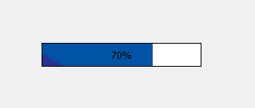
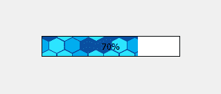
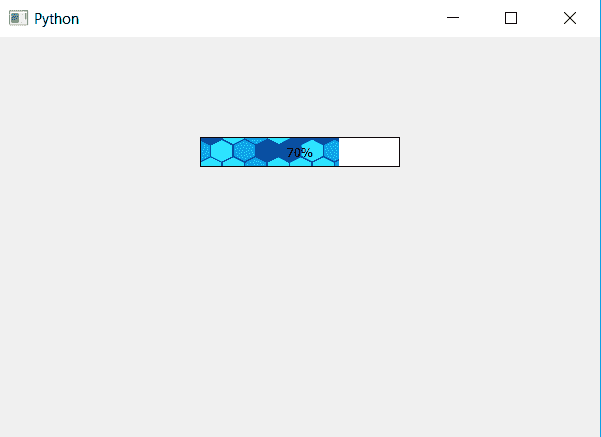

# PyQt5–进度条的皮肤到进度条

> 原文:[https://www . geeksforgeeks . org/pyqt 5-皮肤到进度条/](https://www.geeksforgeeks.org/pyqt5-skin-to-bar-of-progress-bar/)

在本文中，我们将看到如何设置进度条的皮肤。皮肤基本上是一个背景图像，但它自己调整进度条的大小。下面是带有背景图像的进度条和带有皮肤的进度条。

 

为了做到这一点，我们必须改变进度条的 CSS 样式表代码，它与 set 样式表方法一起使用，下面是样式表代码。

```
QProgressBar
{
border :1px solid black;
}
QProgressBar::chunk
{
border-image : url(skin.png);
}

```

下面是实现。

```
# importing libraries
from PyQt5.QtWidgets import * 
from PyQt5 import QtCore, QtGui
from PyQt5.QtGui import * 
from PyQt5.QtCore import * 
import sys

class Window(QMainWindow):

    def __init__(self):
        super().__init__()

        # setting title
        self.setWindowTitle("Python ")

        # setting background color to window
        # self.setStyleSheet("background-color : yellow")

        # setting geometry
        self.setGeometry(100, 100, 600, 400)

        # calling method
        self.UiComponents()

        # showing all the widgets
        self.show()

    # method for widgets
    def UiComponents(self):
        # creating progress bar
        bar = QProgressBar(self)

        # setting geometry to progress bar
        bar.setGeometry(200, 100, 200, 30)

        # setting the value
        value = 70
        bar.setValue(value)

        # setting alignment to center
        bar.setAlignment(Qt.AlignCenter)

        # setting skin to bar to progress bar
        bar.setStyleSheet("QProgressBar "
                          "{"
                          "border : 1px solid black;"
                          "}"
                          "QProgressBar::chunk"
                          "{"
                          "border-image : url(skin.png);"
                          "}"
                          )

App = QApplication(sys.argv)

# create the instance of our Window
window = Window()

# start the app
sys.exit(App.exec())
```

**输出:**
