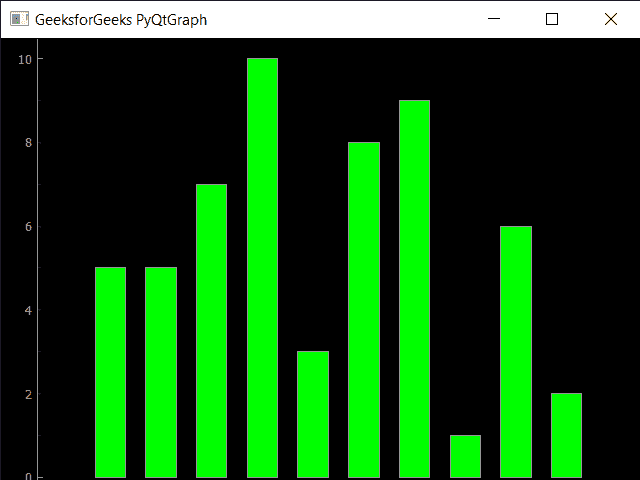

# PyQtGraph–向绘图窗口添加项目

> 原文:[https://www . geeksforgeeks . org/pyqtgraph-添加项目到绘图窗口/](https://www.geeksforgeeks.org/pyqtgraph-adding-item-to-plot-window/)

在本文中，我们将看到如何在 PyQtGraph 模块中向绘图窗口添加项目。PyQtGraph 是 Python 的图形和用户界面库，提供设计和科学应用程序通常需要的功能。它的主要目标是为显示数据(图表、视频等)提供快速的交互式图形。)第二是提供工具来帮助快速应用程序开发(例如，属性树，如在 Qt Designer 中使用的属性树)。绘图窗口由两个主要部分组成:包含实际绘图图形的绘图面板和控制面板。默认情况下，绘图窗口是空的，我们必须添加一些图形或图像来在窗口中显示这些图形/图像/结构是项目。

> 为此，我们对绘图窗口对象使用`addItem`方法
> 
> **语法:** window.addItem(项)
> 
> **参数:**它以 PyQtGraph 小部件对象为参数
> 
> **返回:**返回无

下面是实现

```
# importing pyqtgraph as pg
import pyqtgraph as pg

# importing QtCore and QtGui from the pyqtgraph module
from pyqtgraph.Qt import QtCore, QtGui

# importing numpy as np
import numpy as np

import time

# creating a pyqtgraph plot window
window = pg.plot()

# title
title = "GeeksforGeeks PyQtGraph"

# setting window title
window.setWindowTitle(title)

# create list for y-axis
y1 = [5, 5, 7, 10, 3, 8, 9, 1, 6, 2]

# create horizontal list i.e x-axis
x = [1, 2, 3, 4, 5, 6, 7, 8, 9, 10]

# create pyqt5graph bar graph item 
# with width = 0.6
# with bar colors = green
bargraph1 = pg.BarGraphItem(x = x, height = y1, width = 0.6, brush ='g')

# add item to plot window
# adding bargraph item to the window
window.addItem(bargraph1)

# enabling mouse on the window
window.enableMouse(True)

# main method
if __name__ == '__main__':

    # importing system
    import sys

    # Start Qt event loop unless running in interactive mode or using 
    if (sys.flags.interactive != 1) or not hasattr(QtCore, 'PYQT_VERSION'):
        QtGui.QApplication.instance().exec_()

```

**输出:**
