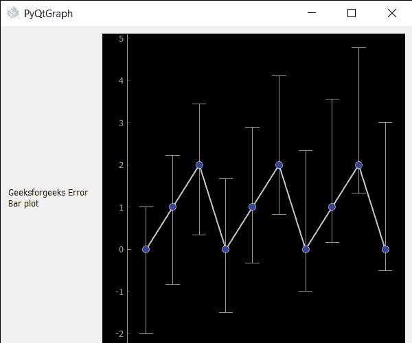

# PyQtGraph–误差条形图

> 原文:[https://www.geeksforgeeks.org/pyqtgraph-error-bar-graph/](https://www.geeksforgeeks.org/pyqtgraph-error-bar-graph/)

在本文中，我们将看到如何在 PyQtGraph 模块中创建一个错误条形图。PyQtGraph 是 Python 的图形和用户界面库，提供设计和科学应用程序通常需要的功能。它的主要目标是为显示数据(图表、视频等)提供快速的交互式图形。).误差线是数据可变性的图形表示，用在图表上表示报告测量中的误差或不确定性。它们给出了测量精度的大致概念，或者相反，真实值可能与报告值有多远。

我们可以创建一个绘图窗口，并在下面给出的命令的帮助下在上面创建误差条形图。

```
# creating a pyqtgraph plot window
plt = pg.plot()

# creating a error bar item object
error = pg.ErrorBarItem(x=x, y=y, top=top, bottom=bottom, beam=0.5)
```

为了在 pyqtgraph 中创建误差条形图，我们必须执行以下操作
1。导入 pyqtgraph 模块
2。导入其他模块，如 numpy 和 pyqt5
3。创建主窗口类
4。创建绘图窗口和误差线项目
5。将 x 轴、y 轴和上下误差值设置到误差条项目
6。创建网格布局
7。将误差条项目添加到绘图窗口，并在绘图窗口
8 上绘制数据。将绘图窗口和附加标签添加到布局中
9。将布局小部件设置为中心小部件

下面是实现

## 蟒蛇 3

```
# importing Qt widgets
from PyQt5.QtWidgets import *

# importing system
import sys

# importing numpy as np
import numpy as np

# importing pyqtgraph as pg
import pyqtgraph as pg
from PyQt5.QtGui import *
from PyQt5.QtCore import *

from collections import namedtuple

class Window(QMainWindow):

    def __init__(self):
        super().__init__()

        # setting title
        self.setWindowTitle("PyQtGraph")

        # setting geometry
        self.setGeometry(100, 100, 600, 500)

        # icon
        icon = QIcon("skin.png")

        # setting icon to the window
        self.setWindowIcon(icon)

        # calling method
        self.UiComponents()

        # showing all the widgets
        self.show()

    # method for components
    def UiComponents(self):

        # creating a widget object
        widget = QWidget()

        # creating a label
        label = QLabel("Geeksforgeeks Error Bar plot")

        # making label do word wrap
        label.setWordWrap(True)

        # setting configuration options
        pg.setConfigOptions(antialias=True)

        # creating x-axis values
        x = np.arange(10)

        # creating y-axis values
        y = np.arange(10) % 3

        # creating upper bound values
        top = np.linspace(1.0, 3.0, 10)

        # creating lower bound values
        bottom = np.linspace(2, 0.5, 10)

        # creating a plot window
        plt = pg.plot()

        # creating a error bar item
        error = pg.ErrorBarItem(x=x, y=y, top=top, bottom=bottom, beam=0.5)

        # adding error bar item to the plot window
        plt.addItem(error)

        # plotting the data on plot window
        plt.plot(x, y, symbol='o', pen={'color': 0.8, 'width': 2})

        # Creating a grid layout
        layout = QGridLayout()

        # minimum width value of the label
        label.setMinimumWidth(130)

        # setting this layout to the widget
        widget.setLayout(layout)

        # adding label in the layout
        layout.addWidget(label, 1, 0)

        # plot window goes on right side, spanning 3 rows
        layout.addWidget(plt, 0, 1, 3, 1)

        # setting this widget as central widget of the main window
        self.setCentralWidget(widget)

# create pyqt5 app
App = QApplication(sys.argv)

# create the instance of our Window
window = Window()

# start the app
sys.exit(App.exec())
```

**输出:**

