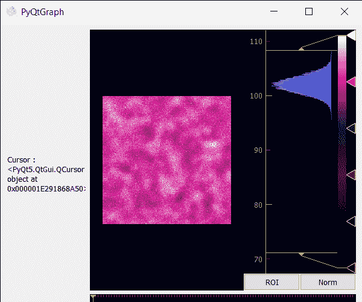

# PyQtGraph–获取图像视图的自定义光标

> 原文:[https://www . geeksforgeeks . org/pyqtgraph-get-custom-游标 of-image-view/](https://www.geeksforgeeks.org/pyqtgraph-getting-custom-cursor-of-image-view/)

在本文中，我们将看到如何在 PyQTGaph 中获得图像视图对象的自定义光标。PyQtGraph 是 Python 的图形和用户界面库，提供设计和科学应用程序通常需要的功能。它的主要目标是为显示数据(图表、视频等)提供快速的交互式图形。).用于显示和分析图像数据的小部件。实现许多功能，如显示 2D 和三维图像数据。对于 3D 数据，显示 z 轴滑块，允许用户选择显示哪个帧。显示图像数据的直方图，可移动区域定义暗/亮级别，可编辑渐变提供颜色查找表。在计算机用户界面中，光标是一种指示器，用于在计算机监视器或其他显示设备上显示用户交互的当前位置，这些显示设备将响应来自文本输入或定点设备的输入。鼠标光标也被称为指针，因为它在用法上类似于指示杆。可以借助 setCursor 方法进行设置。
我们可以借助下面给出的命令创建一个图像视图

```py
# creating a pyqtgraph image view object
imv = pg.ImageView()
```

> 为了做到这一点，我们对图像视图对象
> **使用游标方法语法:** imv.cursor()
> **参数:**它不接受参数
> **返回:**它返回 QCursor 对象

下面是实现

## 蟒蛇 3

```py
# importing Qt widgets
from PyQt5.QtWidgets import *

# importing system
import sys

# importing numpy as np
import numpy as np

# importing pyqtgraph as pg
import pyqtgraph as pg
from PyQt5.QtGui import *
from PyQt5.QtCore import *

# Image View class
class ImageView(pg.ImageView):

    # constructor which inherit original
    # ImageView
    def __init__(self, *args, **kwargs):
        pg.ImageView.__init__(self, *args, **kwargs)

class Window(QMainWindow):

    def __init__(self):
        super().__init__()

        # setting title
        self.setWindowTitle("PyQtGraph")

        # setting geometry
        self.setGeometry(100, 100, 600, 500)

        # icon
        icon = QIcon("skin.png")

        # setting icon to the window
        self.setWindowIcon(icon)

        # calling method
        self.UiComponents()

        # showing all the widgets
        self.show()

        # setting fixed size of window
        #self.setFixedSize(QSize(600, 500))

    # method for components
    def UiComponents(self):

        # creating a widget object
        widget = QWidget()

        # creating a label
        label = QLabel("Geeksforgeeks Image View")

        # setting minimum width
        label.setMinimumWidth(130)

        # making label do word wrap
        label.setWordWrap(True)

        # setting configuration options
        pg.setConfigOptions(antialias=True)

        # creating image view view object
        imv = ImageView()

        # Create random 3D data set with noisy signals
        img = pg.gaussianFilter(np.random.normal(
            size=(200, 200)), (5, 5)) * 20 + 100

        # setting new axis to image
        img = img[np.newaxis, :, :]

        # decay data
        decay = np.exp(-np.linspace(0, 0.3, 100))[:, np.newaxis, np.newaxis]

        # random data
        data = np.random.normal(size=(100, 200, 200))
        data += img * decay
        data += 2

        # adding time-varying signal
        sig = np.zeros(data.shape[0])
        sig[30:] += np.exp(-np.linspace(1, 10, 70))
        sig[40:] += np.exp(-np.linspace(1, 10, 60))
        sig[70:] += np.exp(-np.linspace(1, 10, 30))

        sig = sig[:, np.newaxis, np.newaxis] * 3
        data[:, 50:60, 30:40] += sig

        # setting image to image view
        # Displaying the data and assign each frame a time value from 1.0 to 3.0
        imv.setImage(data, xvals=np.linspace(1., 3., data.shape[0]))

        # Set a custom color map
        colors = [
            (0, 0, 0),
            (4, 5, 61),
            (84, 42, 55),
            (15, 87, 60),
            (208, 17, 141),
            (255, 255, 255)
        ]

        # color map
        cmap = pg.ColorMap(pos=np.linspace(0.0, 1.0, 6), color=colors)

        # setting color map to the image view
        imv.setColorMap(cmap)

        # Creating a grid layout
        layout = QGridLayout()

        # minimum width value of the label
        label.setFixedWidth(130)

        # setting this layout to the widget
        widget.setLayout(layout)

        # adding label in the layout
        layout.addWidget(label, 1, 0)

        # plot window goes on right side, spanning 3 rows
        layout.addWidget(imv, 0, 1, 3, 1)

        # setting this widget as central widget of the main window
        self.setCentralWidget(widget)

        # creating a cursor
        cursor = Qt.ClosedHandCursor

        # setting cursor to the image view
        imv.setCursor(cursor)

        # getting cursor of image view
        value = imv.cursor()

        # setting text to the label
        label.setText("Cursor : " + str(value))

# create pyqt5 app
App = QApplication(sys.argv)

# create the instance of our Window
window = Window()

# start the app
sys.exit(App.exec())
```

**输出:**

