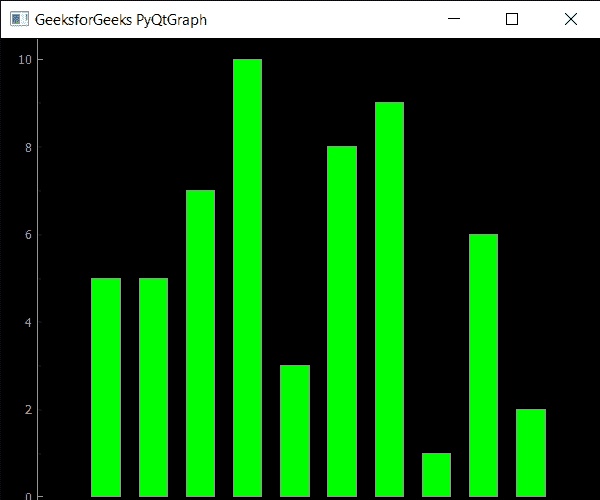

# PyQtGraph–获取绘图窗口的几何图形

> 原文:[https://www . geeksforgeeks . org/pyqtgraph-get-geometry-of-plot-window/](https://www.geeksforgeeks.org/pyqtgraph-getting-geometry-of-plot-window/)

在本文中，我们将看到如何在 PyQtGraph 模块中获得绘图窗口的几何图形。PyQtGraph 是 Python 的图形和用户界面库，提供设计和科学应用程序通常需要的功能。它的主要目标是为显示数据(图表、视频等)提供快速的交互式图形。)第二是提供工具来帮助快速应用程序开发(例如，属性树，如在 Qt Designer 中使用的属性树)。绘图窗口由两个主要部分组成:包含实际绘图图形的绘图面板和控制面板。窗口的几何形状描述了窗口在屏幕上的位置和窗口的大小。可以借助`setGeometry`方法进行设置。

我们可以在下面给出的命令的帮助下创建一个绘图窗口

```py
# creating a pyqtgraph plot window
window = pg.plot()

```

> 为此，我们对绘图窗口对象使用`geometry`方法
> 
> **语法:**窗口.几何()
> 
> **论证:**不需要论证
> 
> **返回:**返回 QRect 对象

下面是实现

```py
# importing pyqtgraph as pg
import pyqtgraph as pg

# importing QtCore and QtGui from the pyqtgraph module
from pyqtgraph.Qt import QtCore, QtGui

# importing numpy as np
import numpy as np

import time

# creating a pyqtgraph plot window
window = pg.plot()

# setting window geometry
# left = 100, top = 100
# width = 600, height = 500
window.setGeometry(100, 100, 600, 500)

# title
title = "GeeksforGeeks PyQtGraph"

# setting window title
window.setWindowTitle(title)

# create list for y-axis
y1 = [5, 5, 7, 10, 3, 8, 9, 1, 6, 2]

# create horizontal list i.e x-axis
x = [1, 2, 3, 4, 5, 6, 7, 8, 9, 10]

# create pyqt5graph bar graph item 
# with width = 0.6
# with bar colors = green
bargraph1 = pg.BarGraphItem(x = x, height = y1, width = 0.6, brush ='g')

# add item to plot window
# adding bargraph item to the window
window.addItem(bargraph1)

# getting geometry of the window
value = window.geometry()

# printing the value
print("Geometry : ", end ="")
print(value)

# main method
if __name__ == '__main__':

    # importing system
    import sys

    # Start Qt event loop unless running in interactive mode or using 
    if (sys.flags.interactive != 1) or not hasattr(QtCore, 'PYQT_VERSION'):
        QtGui.QApplication.instance().exec_()

```

**输出:**


```py
Geometry : PyQt5.QtCore.QRect(100, 100, 600, 500)

```