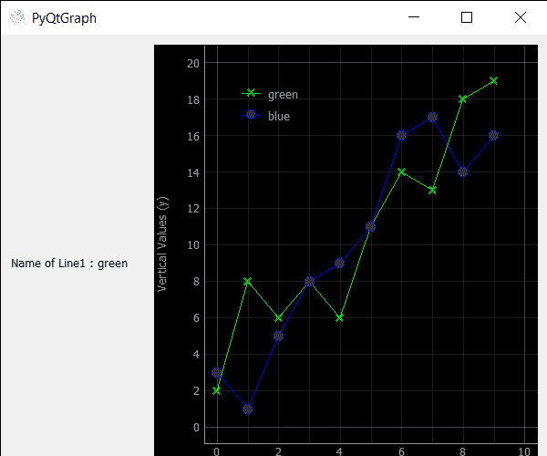

# PyQtGraph–获取线图中的线的名称

> 原文:[https://www . geesforgeks . org/pyqtgraph-get-line-name-in-line-graph/](https://www.geeksforgeeks.org/pyqtgraph-getting-name-of-line-in-line-graph/)

在本文中，我们将看到如何在 PyQtGraph 模块中获得线图的名称。PyQtGraph 是 Python 的图形和用户界面库，提供设计和科学应用程序通常需要的功能。它的主要目标是为显示数据(图表、视频等)提供快速的交互式图形。)折线图、线图、线图或曲线图是一种将信息显示为由直线段连接的一系列数据点(称为“标记”)的图表。它是许多领域中常见的一种基本图表类型。线图是借助 PyQtGraph 中的绘图类创建的。行的名称用于区分各行。
我们可以创建一个绘图窗口，并在下面给出的命令的帮助下在上面创建线条

```
# creating a pyqtgraph plot window
plt = pg.plot()

# ploting line in green color
# with dot symbol as x, not a mandatory field
line = plt.plot(x, y, pen='g', symbol='x', symbolPen='g', symbolBrush=0.2, name='green')
```

> 为此，我们对行对象
> **使用 name 方法语法:** line.name()
> **参数:**它不需要参数
> **Return :** 它返回字符串

下面是实现

## 蟒蛇 3

```
# importing Qt widgets
from PyQt5.QtWidgets import * import sys

# importing pyqtgraph as pg
import pyqtgraph as pg
from PyQt5.QtGui import *

# Bar Graph class
class BarGraphItem(pg.BarGraphItem):

    # constructor which inherit original
    # BarGraphItem
    def __init__(self, *args, **kwargs):
        pg.BarGraphItem.__init__(self, *args, **kwargs)

    # creating a mouse double click event
    def mouseDoubleClickEvent(self, e):

        # setting scale
        self.setScale(0.2)

class Window(QMainWindow):

    def __init__(self):
        super().__init__()

        # setting title
        self.setWindowTitle("PyQtGraph")

        # setting geometry
        self.setGeometry(100, 100, 600, 500)

        # icon
        icon = QIcon("skin.png")

        # setting icon to the window
        self.setWindowIcon(icon)

        # calling method
        self.UiComponents()

        # showing all the widgets
        self.show()

    # method for components
    def UiComponents(self):

        # creating a widget object
        widget = QWidget()

        # creating a new label
        label = QLabel("GeeksforGeeks Line Plot")

        # making it multiline
        label.setWordWrap(True)

        # y values to plot by line 1
        y = [2, 8, 6, 8, 6, 11, 14, 13, 18, 19]

        # y values to plot by line 2
        y2 = [3, 1, 5, 8, 9, 11, 16, 17, 14, 16]
        x = range(0, 10)

        # create plot window object
        plt = pg.plot()

        # showing x and y grids
        plt.showGrid(x = True, y = True)

        # adding legend
        plt.addLegend()

        # set properties of the label for y axis
        plt.setLabel('left', 'Vertical Values', units ='y')

        # set properties of the label for x axis
        plt.setLabel('bottom', 'Horizontal Values', units ='s')

        # setting horizontal range
        plt.setXRange(0, 10)

        # setting vertical range
        plt.setYRange(0, 20)

        # ploting line in green color
        # with dot symbol as x, not a mandatory field
        line1 = plt.plot(x, y, pen ='g', symbol ='x', symbolPen ='g', symbolBrush = 0.2, name ='green')

        # ploting line2 with blue color
        # with dot symbol as o
        line2 = plt.plot(x, y2, pen ='b', symbol ='o', symbolPen ='b', symbolBrush = 0.2, name ='blue')

        # getting name of the line 1
        value = line1.name()

        # setting text to the label
        label.setText("Name of Line1 : " + str(value))

        # label minimum width
        label.setMinimumWidth(150)

        # Creating a grid layout
        layout = QGridLayout()

        # setting this layout to the widget
        widget.setLayout(layout)

        # adding label to the layout
        layout.addWidget(label, 1, 0)

        # plot window goes on right side, spanning 3 rows
        layout.addWidget(plt, 0, 1, 3, 1)

        # setting this widget as central widget of the main window
        self.setCentralWidget(widget)

# create pyqt5 app
App = QApplication(sys.argv)

# create the instance of our Window
window = Window()

# start the app
sys.exit(App.exec())
```

**输出:**

