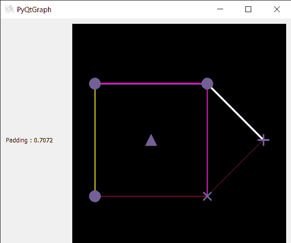

# PyQtGraph–获取图形项目的像素填充

> 原文:[https://www . geeksforgeeks . org/pyqtgraph-get-pixel-padding-of-graph-item/](https://www.geeksforgeeks.org/pyqtgraph-getting-pixel-padding-of-graph-item/)

在本文中，我们将看到如何在 PyQTGaph 中获得图形项的填充。PyQtGraph 是 Python 的图形和用户界面库，提供设计和科学应用程序通常需要的功能。它的主要目标是为显示数据(图表、视频等)提供快速的交互式图形。).图是由节点和边组成的非线性数据结构。节点有时也称为顶点，边是连接图中任意两个节点的直线或圆弧。图由一组有限的顶点(或节点)和一组连接一对节点的边组成。填充是在图形项目的外部和内部之间添加的小空间。

我们可以在下面给出的命令的帮助下创建一个图形布局小部件和图形项目

```py
# creating graphics layout widget
win = pg.GraphicsLayoutWidget()

# creating a graph item
graph_item = pg.GraphItem()
```

> 为了做到这一点，我们对图形项对象
> **使用 pixelPaddingmethod 语法:**imv . pixelpading()
> **参数:**它不需要参数
> **返回:**它返回浮点值

下面是实现

## 蟒蛇 3

```py
# importing Qt widgets
from PyQt5.QtWidgets import *

# importing system
import sys

# importing numpy as np
import numpy as np

# importing pyqtgraph as pg
import pyqtgraph as pg
from PyQt5.QtGui import *
from PyQt5.QtCore import *
import pyqtgraph.ptime as ptime

# Image View class
class ImageView(pg.ImageView):

    # constructor which inherit original
    # ImageView
    def __init__(self, *args, **kwargs):
        pg.ImageView.__init__(self, *args, **kwargs)

class Window(QMainWindow):

    def __init__(self):
        super().__init__()

        # setting title
        self.setWindowTitle("PyQtGraph")

        # setting geometry
        self.setGeometry(100, 100, 600, 500)

        # icon
        icon = QIcon("skin.png")

        # setting icon to the window
        self.setWindowIcon(icon)

        # calling method
        self.UiComponents()

        # showing all the widgets
        self.show()

    # method for components
    def UiComponents(self):

        # creating a widget object
        widget = QWidget()

        # creating a label
        label = QLabel("Geeksforgeeks Graph Item")

        # setting minimum width
        label.setMinimumWidth(130)

        # making label do word wrap
        label.setWordWrap(True)

        # setting configuration options
        pg.setConfigOptions(antialias=True)

        # creating graphics layout widget
        win = pg.GraphicsLayoutWidget()

        # adding view box to the graphic layout widget
        view = win.addViewBox()

        # lock the aspect ratio
        view.setAspectLocked()

        # creating a graph item
        graph_item = pg.GraphItem()

        # adding graph item to the view box
        view.addItem(graph_item)

        # Define positions of nodes
        pos = np.array([
            [0, 0],
            [10, 0],
            [0, 10],
            [10, 10],
            [5, 5],
            [15, 5]
        ])

        # Define the set of connections in the graph
        adj = np.array([
            [0, 1],
            [1, 3],
            [3, 2],
            [2, 0],
            [1, 5],
            [3, 5],
        ])

        # Define the symbol to use for each node (this is optional)
        symbols = ['o', 'x', 'o', 'o', 't', '+']

        # Define the line style for each connection (this is optional)
        lines = np.array([
            (255, 0, 0, 255, 1),
            (255, 0, 255, 255, 2),
            (255, 0, 255, 255, 3),
            (255, 255, 0, 255, 2),
            (255, 0, 0, 255, 1),
            (255, 255, 255, 255, 4),
        ], dtype=[('red', np.ubyte), ('green', np.ubyte), ('blue', np.ubyte), ('alpha', np.ubyte), ('width', float)])

        # Update the graph
        graph_item.setData(pos=pos, adj=adj, pen=lines,
                           size=1, symbol=symbols, pxMode=False)

        # Creating a grid layout
        layout = QGridLayout()

        # minimum width value of the label
        label.setMinimumWidth(130)

        # setting this layout to the widget
        widget.setLayout(layout)

        # adding label in the layout
        layout.addWidget(label, 1, 0)

        # plot window goes on right side, spanning 3 rows
        layout.addWidget(win, 0, 1, 3, 1)

        # setting this widget as central widget of the main window
        self.setCentralWidget(widget)

        # getting padding of graph item
        value = graph_item.pixelPadding()

        # setting text to the label
        label.setText("Padding : " + str(value))

# create pyqt5 app
App = QApplication(sys.argv)

# create the instance of our Window
window = Window()

# start the app
sys.exit(App.exec())
```

**输出:**

