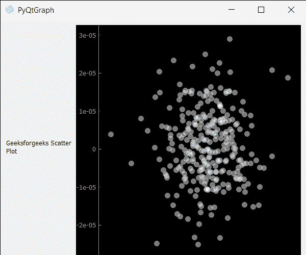

# PyQtGraph–散点图

> 原文:[https://www.geeksforgeeks.org/pyqtgraph-scatter-plot-graph/](https://www.geeksforgeeks.org/pyqtgraph-scatter-plot-graph/)

在本文中，我们将了解如何使用 PyQtGraph 模块创建散点图。PyQtGraph 是一个图形和用户界面 Python 库，用于设计和科学应用程序中通常需要的功能。它为显示数据(图表、视频等)提供了快速的交互式图形。).散点图使用点来表示两个不同数值变量的值。这是一种使用笛卡尔坐标来显示一组数据的两个变量的值的绘图类型。水平轴和垂直轴上每个点的位置表示单个数据点的值。散点图用于观察变量之间的关系。

我们可以创建一个绘图窗口，并在下面给出的命令的帮助下在上面创建散点图

```py
# creating a pyqtgraph plot window
plt = pg.plot()

# creating a scatter plot graphof size = 10
scatter = pg.ScatterPlotItem(size=10)
```

为了在 pyqtgraph 中创建散点图，需要遵循以下步骤:

1.  导入 pyqtgraph 模块
2.  导入其他模块，如 numpy 和 pyqt5
3.  创建主窗口类
4.  创建散点图项目
5.  使用 numpy 在任意位置创建随机点
6.  将这些点添加到散点图数据中
7.  创建网格布局
8.  向布局添加散点图和附加标签
9.  将布局小部件设置为中心小部件

**例:**

## 蟒蛇 3

```py
# importing Qt widgets
from PyQt5.QtWidgets import *

# importing system
import sys

# importing numpy as np
import numpy as np

# importing pyqtgraph as pg
import pyqtgraph as pg
from PyQt5.QtGui import *

class Window(QMainWindow):

    def __init__(self):
        super().__init__()

        # setting title
        self.setWindowTitle("PyQtGraph")

        # setting geometry
        self.setGeometry(100, 100, 600, 500)

        # icon
        icon = QIcon("skin.png")

        # setting icon to the window
        self.setWindowIcon(icon)

        # calling method
        self.UiComponents()

        # showing all the widgets
        self.show()

    # method for components
    def UiComponents(self):

        # creating a widget object
        widget = QWidget()

        # creating a label
        label = QLabel("Geeksforgeeks Scatter Plot")

        # making label do word wrap
        label.setWordWrap(True)

        # creating a plot window
        plot = pg.plot()

        # number of points
        n = 300

        # creating a scatter plot item
        # of size = 10
        # using brush to enlarge the of white color with transparency is 50%
        scatter = pg.ScatterPlotItem(
            size=10, brush=pg.mkBrush(255, 255, 255, 120))

        # getting random position
        pos = np.random.normal(size=(2, n), scale=1e-5)

        # creating spots using the random position
        spots = [{'pos': pos[:, i], 'data': 1}
                 for i in range(n)] + [{'pos': [0, 0], 'data': 1}]

        # adding points to the scatter plot
        scatter.addPoints(spots)

        # add item to plot window
        # adding scatter plot item to the plot window
        plot.addItem(scatter)

        # Creating a grid layout
        layout = QGridLayout()

        # minimum width value of the label
        label.setMinimumWidth(130)

        # setting this layout to the widget
        widget.setLayout(layout)

        # adding label in the layout
        layout.addWidget(label, 1, 0)

        # plot window goes on right side, spanning 3 rows
        layout.addWidget(plot, 0, 1, 3, 1)

        # setting this widget as central widget of the main window
        self.setCentralWidget(widget)

# create pyqt5 app
App = QApplication(sys.argv)

# create the instance of our Window
window = Window()

# start the app
sys.exit(App.exec())
```

**输出:**

