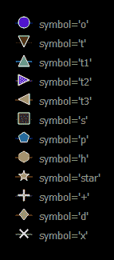

# pyqtgraph-符号

> 原文:[https://www.geeksforgeeks.org/pyqtgraph-symbols/](https://www.geeksforgeeks.org/pyqtgraph-symbols/)

PyQtGraph 是一个图形和用户界面 Python 库，用于设计和科学应用程序中通常需要的功能。它为显示数据(图表、视频等)提供了快速的交互式图形。).折线图是一种图形类型，它将信息显示为一系列数据点，通常称为标记，由直线段连接。散点图使用点来表示两个不同数值变量的值。这是一种图形类型，使用笛卡尔坐标来显示一组数据的两个典型变量的值

当我们创建折线图或散点图时，需要使用某些符号突出显示代表某些数据的点，默认情况下是圆，但这可以根据需要进行修改。pyqtgraph 总共提供了 12 个符号，可用于根据需要更改符号。
以下是本模块中可用的符号列表:

*   **o :** 默认符号，圆形符号
*   **t :** 向下的三角形符号
*   **t1 :** 指向上方的三角形符号
*   **t2 :** 指向右侧符号的三角形
*   **t3 :** 三角形指向左侧符号
*   **s :** 方形符号
*   **p :** 五边形符号
*   **h :** 六边形符号
*   **星:**星符号
*   +:加符号
*   **d :** 棱镜符号
*   **x :** 十字符号
    这是它们在输出屏幕上的显示方式:



我们可以借助下面给出的命令创建一个绘图窗口:

```
plt = pg.plot()
```

为了实现上述概念，可以遵循以下步骤:

*   导入 pyqtgraph、pyqt5 和 numpy 模块
*   创建主窗口类
*   创建绘图窗口对象
*   向绘图窗口添加图例
*   创建 12 条具有不同点的线，这样它们就不会彼此相交，并分离出不同的符号和颜色
*   将绘图窗口和其他小部件(如标签)添加到网格布局中
*   将网格布局小部件设置为主窗口的中心小部件

**示例:**

## 蟒蛇 3

```
# importing Qt widgets
from PyQt5.QtWidgets import *

# importing system
import sys

# importing numpy as np
import numpy as np

# importing pyqtgraph as pg
import pyqtgraph as pg
from PyQt5.QtGui import * from PyQt5.QtCore import * from collections import namedtuple

class Window(QMainWindow):

    def __init__(self):
        super().__init__()

        # setting title
        self.setWindowTitle("PyQtGraph")

        # setting geometry
        self.setGeometry(100, 100, 800, 500)

        # icon
        icon = QIcon("skin.png")

        # setting icon to the window
        self.setWindowIcon(icon)

        # calling method
        self.UiComponents()

        # showing all the widgets
        self.show()

    # method for components
    def UiComponents(self):

        # creating a widget object
        widget = QWidget()

        # text
        text = "Geeksforgeeks Different Symbols"

        # creating a label
        label = QLabel(text)

        # setting minimum width
        label.setMinimumWidth(130)

        # making label do word wrap
        label.setWordWrap(True)

        # setting pyqtgraph configuration
        pg.setConfigOptions(antialias = True)

        # creating a plot window
        plot = pg.plot()

        # adding legend to the plot window
        plot.addLegend()

        # plot the line1 with symbol o
        # having color blue
        line1 = plot.plot([1, 1, 1, 1, 1], pen =(0, 0, 200), symbolBrush =(0, 0, 200),
                          symbolPen ='w', symbol ='o', symbolSize = 14, name ="symbol ='o'")

        # plot the line2 with symbol t
        # having color green
        line2 = plot.plot([2, 2, 2, 2, 2], pen =(0, 128, 0), symbolBrush =(0, 128, 0),
                          symbolPen ='w', symbol ='t', symbolSize = 14, name ="symbol ='t'")

        # plot the line3 with symbol t1
        # having color bluegreen
        line3 = plot.plot([3, 3, 3, 3, 3], pen =(19, 234, 201), symbolBrush =(19, 234, 201),
                          symbolPen ='w', symbol ='t1', symbolSize = 14, name ="symbol ='t1'")

        # plot the line4 with symbol t2
        # having color purple
        line4 = plot.plot([4, 4, 4, 4, 4], pen =(195, 46, 212), symbolBrush =(195, 46, 212),
                          symbolPen ='w', symbol ='t2', symbolSize = 14, name ="symbol ='t2'")

        # plot the line5 with symbol t3
        # having color brownish
        line5 = plot.plot([5, 5, 5, 5, 5], pen =(250, 194, 5), symbolBrush =(250, 194, 5),
                          symbolPen ='w', symbol ='t3', symbolSize = 14, name ="symbol ='t3'")

        # plot the line6 with symbol s
        # having color grey
        line6 = plot.plot([6, 6, 6, 6, 6], pen =(54, 55, 55), symbolBrush =(55, 55, 55), symbolPen ='w', symbol ='s', symbolSize = 14,
                  name ="symbol ='s'")

        # plot the line7 with symbol p
        # having color sky blue
        line7 = plot.plot([7, 7, 7, 7, 7], pen =(0, 114, 189), symbolBrush =(0, 114, 189),
                         symbolPen ='w', symbol ='p', symbolSize = 14, name ="symbol ='p'")

        # plot the line8 with symbol h
        # having color orange
        line8 = plot.plot([8, 8, 8, 8, 8], pen =(217, 83, 25), symbolBrush =(217, 83, 25),
                          symbolPen ='w', symbol ='h', symbolSize = 14, name ="symbol ='h'")

        # plot the line9 with symbol star
        # having yellow color
        line9 = plot.plot([9, 9, 9, 9, 9], pen =(237, 177, 32), symbolBrush =(237, 177, 32),
                          symbolPen ='w', symbol ='star', symbolSize = 14, name ="symbol ='star'")

        # plot the line10 with symbol +
        # having blueish color
        line10 = plot.plot([10, 10, 10, 10, 10], pen =(126, 47, 142), symbolBrush =(126, 47, 142),
                           symbolPen ='w', symbol ='+', symbolSize = 14, name ="symbol ='+'")

        # plot the line11 with symbol d
        # having greensih color
        line11 = plot.plot([11, 11, 11, 11, 11], pen =(119, 172, 48), symbolBrush =(119, 172, 48),
                           symbolPen ='w', symbol ='d', symbolSize = 14, name ="symbol ='d'")

        # plot the line12 with symbol x
        # having off white color
        line12 = plot.plot([12, 12, 12, 12, 12], pen =(180, 180, 180), symbolBrush =(180, 180, 180),
                           symbolPen ='w', symbol ='x', symbolSize = 14, name ="symbol ='x'")

        # setting x-axis range
        plot.setXRange(-3, 4)

        # Creating a grid layout
        layout = QGridLayout()

        # minimum width value of the label
        label.setMinimumWidth(130)

        # setting this layout to the widget
        widget.setLayout(layout)

        # adding label in the layout
        layout.addWidget(label, 1, 0)

        # plot window goes on right side, spanning 3 rows
        layout.addWidget(plot, 0, 1, 3, 1)

        # setting this widget as central widget of the main window
        self.setCentralWidget(widget)

# create pyqt5 app
App = QApplication(sys.argv)

# create the instance of our Window
window = Window()

# start the app
sys.exit(App.exec())
```

**输出:**

<video class="wp-video-shortcode" id="video-504259-1" width="640" height="360" preload="metadata" controls=""><source type="video/mp4" src="https://media.geeksforgeeks.org/wp-content/uploads/20201001005255/PyQtGraph-2020-10-01-00-52-28.mp4?_=1">[https://media.geeksforgeeks.org/wp-content/uploads/20201001005255/PyQtGraph-2020-10-01-00-52-28.mp4](https://media.geeksforgeeks.org/wp-content/uploads/20201001005255/PyQtGraph-2020-10-01-00-52-28.mp4)</video>