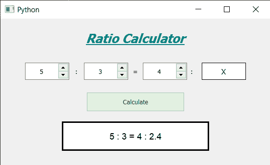

# 使用 PyQt5 的比率计算器

> 原文:[https://www.geeksforgeeks.org/ratio-calculator-using-pyqt5/](https://www.geeksforgeeks.org/ratio-calculator-using-pyqt5/)

在本文中，我们将看到如何使用 PyQt5 创建一个比率计算器。比率是一种对比，它存在于两个特定的数字之间，被定义为比率。这个比率计算器是用来计算这种对比，并找出这些数字之间的关系。下面是计算器的外观



**PyQt5** 是跨平台的 GUI 工具包，一套针对 Qt v5 的 python 绑定。由于该库提供的工具和简单性，人们可以非常容易地开发交互式桌面应用程序。下面是安装 PyQt5 的命令

```py
pip install PyQt5
```

**概念:**
用户必须选择一个比率，然后输入另一个数字，计算器会找到相应的比率值，下面是使用的公式

```py
A / B = C / X

```

这里，A 和 B 是选定的比率，C 是输入的数字，我们必须找到对应的比率值

> **GUI 实现步骤:**
> 1。创建显示计算器名称
> 2 的标题标签。创建三个旋转框以获得“A”、“B”和“C”值
> 3。为比率和等于符号在旋转框之间创建标签，并为显示“X”值创建标签
> 4。创建计算比率值的按钮
> 5。创建一个标签来显示计算值
> 
> **后端实现:**
> 1。将范围设置为每个旋转框的最小值等于 1，这样用户就不能输入 0 作为输入
> 2。在窗口
> 3 中为每个小部件设置各种属性，如对齐、几何。为按钮
> 4 添加颜色效果。点击按钮时向按钮添加动作
> 5。在按钮动作内部，根据用户输入的值计算“X”的值
> 6。如果是整数
> 7，去掉小数值。借助结果标签显示输出

下面是实现

```py
# importing libraries
from PyQt5.QtWidgets import * from PyQt5 import QtCore, QtGui
from PyQt5.QtGui import * from PyQt5.QtCore import * import sys

class Window(QMainWindow):

    def __init__(self):
        super().__init__()

        # setting title
        self.setWindowTitle("Python ")

        # width of window
        self.w_width = 550

        # height of window
        self.w_height = 300

        # setting geometry
        self.setGeometry(100, 100, self.w_width, self.w_height)

        # calling method
        self.UiComponents()

        # showing all the widgets
        self.show()

    # method for components
    def UiComponents(self):

        # creating head label
        head = QLabel("Ratio Calculator", self)

        head.setWordWrap(True)

        # setting geometry to the head
        head.setGeometry(0, 10, 550, 60)

        # font
        font = QFont('Times', 15)
        font.setBold(True)
        font.setItalic(True)
        font.setUnderline(True)

        # setting font to the head
        head.setFont(font)

        # setting alignment of the head
        head.setAlignment(Qt.AlignCenter)

        # setting color effect to the head
        color = QGraphicsColorizeEffect(self)
        color.setColor(Qt.darkCyan)
        head.setGraphicsEffect(color)

        # creating a spin box
        self.a_spin = QSpinBox(self)

        # setting geometry
        self.a_spin.setGeometry(50, 90, 90, 35)

        # setting alignment
        self.a_spin.setAlignment(Qt.AlignCenter)

        # setting range
        self.a_spin.setRange(1, 999999)

        # creating a label
        l1 = QLabel(" : ", self)

        # setting geometry
        l1.setGeometry(140, 90, 30, 35)

        # setting alignment
        l1.setAlignment(Qt.AlignCenter)

        # creating a spin box
        self.b_spin = QSpinBox(self)

        # setting geometry
        self.b_spin.setGeometry(170, 90, 90, 35)

        # setting alignment
        self.b_spin.setAlignment(Qt.AlignCenter)

        # setting range
        self.b_spin.setRange(1, 999999)

        # creating a label
        l2 = QLabel(" = ", self)

        # setting geometry
        l2.setGeometry(260, 90, 30, 35)

        # setting alignment
        l2.setAlignment(Qt.AlignCenter)

        # creating a spin box
        self.c_spin = QSpinBox(self)

        # setting geometry
        self.c_spin.setGeometry(290, 90, 90, 35)

        # setting alignment
        self.c_spin.setAlignment(Qt.AlignCenter)

        # setting range
        self.c_spin.setRange(1, 999999)

        # creating a label
        l3 = QLabel(" : ", self)

        # setting geometry
        l3.setGeometry(380, 90, 20, 35)

        # setting alignment
        l3.setAlignment(Qt.AlignCenter)

        # creating a label
        lx = QLabel("X", self)

        # setting geometry
        lx.setGeometry(410, 90, 90, 35)

        # setting alignment
        lx.setAlignment(Qt.AlignCenter)

        # setting style sheet
        lx.setStyleSheet("QLabel"
                         "{"
                         "border : 1px solid black;"
                         "background-color : white;"
                         "font-size : 15px;"
                         "}")

        # creating a push button
        calculate = QPushButton("Calculate", self)

        # setting geometry to the push button
        calculate.setGeometry(175, 150, 200, 40)

        # adding action to the button
        calculate.clicked.connect(self.calculate)

        # adding color effect to the push button
        color = QGraphicsColorizeEffect()
        color.setColor(Qt.darkGreen)
        calculate.setGraphicsEffect(color)

        # creating a label to show result
        self.result = QLabel(self)

        # setting properties to result label
        self.result.setAlignment(Qt.AlignCenter)

        # setting geometry
        self.result.setGeometry(125, 210, 300, 60)

        # making it multi line
        self.result.setWordWrap(True)

        # setting stylesheet
        # adding border and background
        self.result.setStyleSheet("QLabel"
                                  "{"
                                  "border : 3px solid black;"
                                  "background : white;"
                                  "}")

        # setting font
        self.result.setFont(QFont('Arial', 11))

    def calculate(self):

        # getting spin box 'a' value
        a = self.a_spin.value()

        # getting spin box 'b' value
        b = self.b_spin.value()

        # getting spin box 'c value
        c = self.c_spin.value()

        # calculating 'x' value
        x = (c * b) / a

        # removing decimal if decimal is zero
        if x % 1 == 0:
            x = int(x)

        # setting text to the result label
        self.result.setText(str(a) + " : " + str(b) + " = "
                            + str(c) + " : " + str(x))

# create pyqt5 app
App = QApplication(sys.argv)

# create the instance of our Window
window = Window()

# start the app
sys.exit(App.exec())
```

**输出:**

<video class="wp-video-shortcode" id="video-447272-1" width="665" height="356" preload="metadata" controls=""><source type="video/mp4" src="https://media.geeksforgeeks.org/wp-content/uploads/20200705034349/Python-2020-07-05-03-43-22.mp4?_=1">[https://media.geeksforgeeks.org/wp-content/uploads/20200705034349/Python-2020-07-05-03-43-22.mp4](https://media.geeksforgeeks.org/wp-content/uploads/20200705034349/Python-2020-07-05-03-43-22.mp4)</video>