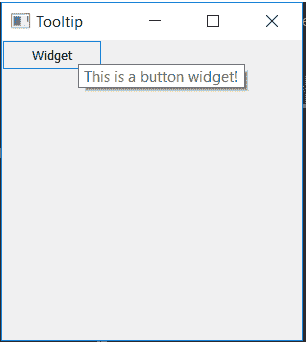

# 在 PyQt5

中设置工具提示方法

> 原文:[https://www.geeksforgeeks.org/settooltip-method-in-pyqt5/](https://www.geeksforgeeks.org/settooltip-method-in-pyqt5/)

`setToolTip()`方法用于在 PyqT5 应用程序中设置小部件的工具提示。

**工具提示**是桌面应用程序(图形用户界面)中的提示。当鼠标悬停在小部件上而没有单击它时，工具提示经常出现。有时，当鼠标箭头停留在按钮上时，它会显示一些信息，这些信息就是工具提示信息。

> **语法:**widget . settoltip(message)
> 
> **自变量:**它以字符串为自变量。

下面是这个方法的实现。

```py
# importing the required libraries
from PyQt5.QtGui import * 
from PyQt5.QtWidgets import * 
import sys

class Window(QMainWindow):
    def __init__(self):
        super().__init__()

        # set the title
        self.setWindowTitle("Tooltip")

        # set the geometry
        self.setGeometry(0, 0, 300, 300)

        # creating a button widget
        self.widget = QPushButton('Widget', self)

        # setting up the tooltip
        self.widget.setToolTip("This is a button widget !")

        # show all the widgets
        self.show()

# create pyqt5 app
App = QApplication(sys.argv)

# create the instance of our Window
window = Window()

# start the app
sys.exit(App.exec())
```

**输出:**
