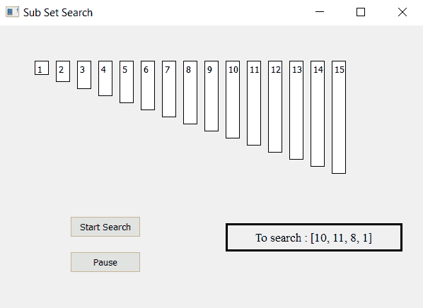

# 使用 PyQt5 的子集搜索可视化工具

> 原文:[https://www . geesforgeks . org/subset-search-visualizer-using-pyqt 5/](https://www.geeksforgeeks.org/sub-set-search-visualizer-using-pyqt5/)

在本文中，我们将看到如何制作一个 PyQt5 应用程序来可视化子集搜索算法。

**子集搜索:**有时我们会遇到这样的问题:检查一个列表是否只是列表的扩展，即只是一个列表的超集。这类问题在竞争性编程中相当普遍。

**示例–**

> **输入:**列表= [1，2，3，4，5，6，7]，子列表= [2，4，7]
> 
> **输出:**找到列表
> 
> **输入:**列表= [1，2，3，4，5，6，7]，子列表= [5，1，7]
> **输出:**列表找到



> **GUI 实现步骤:**
> 
> 1.根据给定的数字列表
> 2 创建标签列表。将它们的文字、边框、颜色和几何图形设置为彼此有相应的间隙
> 3。每个标签高度应与每个数字的值成比例
> 4。创建开始和暂停按钮，开始搜索并暂停搜索
> 5。创建结果标签以显示搜索状态
> 
> **后端实现步骤:**
> 1。创建对应于给定编号的标签列表
> 2。为列表索引和子列表索引创建变量并标记搜索
> 3。向按钮添加动作他们的动作应该改变标志状态，即开始动作应该使标志为真，暂停动作应该使标志为假，以及一个计数器来计数匹配的数量
> 4。创建定时器对象，该对象在每个特定时间后调用一个方法
> 5。在定时器方法内检查标志是否为真标志为真开始完美子列表搜索算法
> 6。用列表的第一个元素检查子列表的第一个元素，如果找到，增加子列表索引，增加计数器，重置列表索引，否则增加列表索引
> 7。如果索引等于列表长度，停止搜索并显示结果为未找到。
> 8。如果计数器变得等于子列表的长度，则显示找到的结果。

下面是实现

```py
# importing libraries
from PyQt5.QtWidgets import *
from PyQt5 import QtCore, QtGui
from PyQt5.QtGui import *
from PyQt5.QtCore import *

import sys

class Window(QMainWindow):
    # list of numbers
    number = [1, 2, 3, 4, 5, 6, 7, 8, 9, 
                 10, 11, 12, 13, 14, 15]

    # desired list
    desired = [10, 11, 8, 4]

    def __init__(self):
        super().__init__()

        # setting title
        self.setWindowTitle("Sub Set Search")

        # setting geometry
        self.setGeometry(100, 100, 600, 400)

        # calling method
        self.UiComponents()

        # showing all the widgets
        self.show()

    # method for widgets
    def UiComponents(self):

        # start flag
        self.start = False

        # list to hold labels
        self.label_list = []

        # match sub list
        self.match = []

        # index of both list
        self.list_index = 0
        self.sub_index = 0

        # local counter
        c = 0

        # iterating list of numbers
        for i in self.number:
            # creating label for each number
            label = QLabel(str(i), self)

            # adding background color and border
            label.setStyleSheet("border : 1px solid black;
                                 background : white;")

            # aligning the text
            label.setAlignment(Qt.AlignTop)

            # setting geometry using local counter
            # first parameter is distance from left 
            # and second is distance from top
            # third is width and forth is height
            label.setGeometry(50 + c * 30, 50, 20, i * 10 + 10)

            # adding label to the label list
            self.label_list.append(label)

            # incrementing local counter
            c = c + 1

        # creating push button to start the search
        self.search_button = QPushButton("Start Search", self)

        # setting geometry of the button
        self.search_button.setGeometry(100, 270, 100, 30)

        # adding action to the search button
        self.search_button.clicked.connect(self.search_action)

        # creating push button to pause the search
        pause_button = QPushButton("Pause", self)

        # setting geometry of the button
        pause_button.setGeometry(100, 320, 100, 30)

        # adding action to the search button
        pause_button.clicked.connect(self.pause_action)

        # creating label to show the result
        self.result = QLabel("To search : " + str(self.desired), self)

        # setting geometry
        self.result.setGeometry(320, 280, 250, 40)

        # setting style sheet
        self.result.setStyleSheet("border : 3px solid black;")

        # adding font
        self.result.setFont(QFont('Times', 10))

        # setting alignment
        self.result.setAlignment(Qt.AlignCenter)

        # creating a timer object
        timer = QTimer(self)

        # adding action to timer
        timer.timeout.connect(self.showTime)

        # update the timer every 300 millisecond
        timer.start(300)

    # method called by timer
    def showTime(self):

        # checking if flag is true
        if self.start:

            # if index exceeds limit
            if self.list_index >= len(self.number):

                # stop the search and show result not found
                self.start = False
                self.result.setText("Not Found")
                return

            # check for the element
            if self.desired[self.sub_index] == self.number[self.list_index]:

                # append it the match counter
                self.match.append(self.list_index)

                # make label color yellow and rest of whitee color
                for i in range(len(self.label_list)):
                    self.label_list[i].setStyleSheet(
                          "border : 1px solid yellow;"
                          "background-color : white;"
                                                     )

                    # dor matched label make them yellow color
                    if i in self.match:
                        self.label_list[i].setStyleSheet(
                                 "border : 2px solid yellow;"
                                 "background-color : yellow;" )

                # increment sub index
                self.sub_index += 1

                # reset the list index
                self.list_index = 0

            # if not found
            else:

                # make checked index label grey
                self.label_list[self.sub_index + self.list_index].setStyleSheet(
                                     "border :" "1px solid black;"
                                     "background-color : grey;" )

                # increment list index
                self.list_index += 1

            # if matches become equal to desired list
            if len(self.match) == len(self.desired):
                # stop search
                self.start =False

                # show result
                self.result.setText("Found at : " + str(self.match))

                # make matched index green
                for i in self.match:
                    self.label_list[i].setStyleSheet(
                            "border : 2px solid green;"
                            "background-color : lightgreen;")

    # method called by search button
    def search_action(self):

        # making flag true
        self.start = True

        # showing text in result label
        self.result.setText("Started searching...")

    # method called by pause button
    def pause_action(self):

        # making flag false
        self.start = False

        # showing text in result label
        self.result.setText("Paused")

# create pyqt5 app
App = QApplication(sys.argv)

# create the instance of our Window
window = Window()

# start the app
sys.exit(App.exec())
```

**输出:**

<video class="wp-video-shortcode" id="video-406364-1" width="640" height="428" preload="metadata" controls=""><source type="video/mp4" src="https://media.geeksforgeeks.org/wp-content/uploads/20200421213822/Sub-Set-Search-21-04-2020-21_31_36.mp4?_=1">[https://media.geeksforgeeks.org/wp-content/uploads/20200421213822/Sub-Set-Search-21-04-2020-21_31_36.mp4](https://media.geeksforgeeks.org/wp-content/uploads/20200421213822/Sub-Set-Search-21-04-2020-21_31_36.mp4)</video>