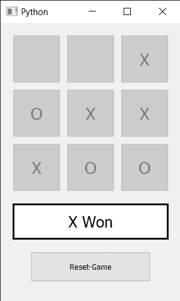

# 使用 Python 中 PyQt5 的井字游戏

> 原文:[https://www . geeksforgeeks . org/TIC-tac-toe-game-use-pyqt 5-in-python/](https://www.geeksforgeeks.org/tic-tac-toe-game-using-pyqt5-in-python/)

在本文中，我们将看到如何使用 [**PyQt5**](https://www.geeksforgeeks.org/python-introduction-to-pyqt5/) 创建一个**井字游戏**。井字游戏(Tic-tac-toe)、零号和十字，或 Xs 和 Os 是一个纸笔游戏，由 X 和 O 两个玩家轮流在 3×3 的格子中标记空格。成功地在水平、垂直或对角线行中放置三个标记的玩家是赢家。

下面是井字游戏的样子:



> **GUI 实现步骤:**
> **1。**创建按钮列表
> **2。**按 3×3 的顺序排列，加上字体
> **3** 。在按钮下方创建一个标签，告知结果
> **4。**设置标签
> **5** 的对齐方式和字体。在底部添加另一个按钮来重置游戏

> **后端实现步骤** :
> **1。**创建两个变量来知道谁的机会，并知道完成了多少机会
> **2** 。将相同的动作添加到按钮列表中，使每个按钮调用相同的动作
> **3** 。在动作方法中，使用发送者方法
> **4 获取调用方法的按钮。**根据几率将文字设置到按钮上并使其禁用，使其不能再次按下，调用 who _ wins 方法
> **5** 。根据 who_wins 方法
> **6** 返回的答案设置文字。在 who_wins 方法中，检查行、列和对角线是否交叉。
> **7。**如果有人赢得比赛，将文本设置到标签上，并禁用所有按钮
> **8。**对复位按钮
> **9** 增加动作。在重置按钮操作中，将变量值设置为起始值，启用所有按钮，并将标签和按钮文本留空。

下面是实现:

## 蟒蛇 3

```py
# importing required libraries
from PyQt5.QtWidgets import *
from PyQt5 import QtCore, QtGui
from PyQt5.QtGui import *
from PyQt5.QtCore import *

import sys

# create a Window class
class Window(QMainWindow):
    # constructor
    def __init__(self):
        super().__init__()

        # setting title
        self.setWindowTitle("Python ")

        # setting geometry
        self.setGeometry(100, 100, 
                         300, 500)

        # calling method
        self.UiComponents()

        # showing all the widgets
        self.show()

    # method for components
    def UiComponents(self):

        # turn
        self.turn = 0

        # times
        self.times = 0

        # creating a push button list
        self.push_list = []

        # creating 2d list
        for _ in range(3):
            temp = []
            for _ in range(3):
                temp.append((QPushButton(self)))
            # adding 3 push button in single row
            self.push_list.append(temp)

        # x and y co-ordinate
        x = 90
        y = 90

        # traversing through push button list
        for i in range(3):
            for j in range(3):

                # setting geometry to the button
                self.push_list[i][j].setGeometry(x*i + 20, 
                                                 y*j + 20,
                                                 80, 80)

                # setting font to the button
                self.push_list[i][j].setFont(QFont(QFont('Times', 17)))

                # adding action
                self.push_list[i][j].clicked.connect(self.action_called)

        # creating label to tel the score
        self.label = QLabel(self)

        # setting geometry to the label
        self.label.setGeometry(20, 300, 260, 60)

        # setting style sheet to the label
        self.label.setStyleSheet("QLabel"
                                 "{"
                                 "border : 3px solid black;"
                                 "background : white;"
                                 "}")

        # setting label alignment
        self.label.setAlignment(Qt.AlignCenter)

        # setting font to the label
        self.label.setFont(QFont('Times', 15))

        # creating push button to restart the score
        reset_game = QPushButton("Reset-Game", self)

        # setting geometry
        reset_game.setGeometry(50, 380, 200, 50)

        # adding action action to the reset push button
        reset_game.clicked.connect(self.reset_game_action)

    # method called by reset button
    def reset_game_action(self):

        # resetting values
        self.turn = 0
        self.times = 0

        # making label text empty:
        self.label.setText("")

        # traversing push list
        for buttons in self.push_list:
            for button in buttons:
                # making all the button enabled
                button.setEnabled(True)
                # removing text of all the buttons
                button.setText("")

    # action called by the push buttons
    def action_called(self):

        self.times += 1

        # getting button which called the action
        button = self.sender()

        # making button disabled
        button.setEnabled(False)

        # checking the turn
        if self.turn == 0:
            button.setText("X")
            self.turn = 1
        else:
            button.setText("O")
            self.turn = 0

        # call the winner checker method
        win = self.who_wins()

        # text
        text = ""

        # if winner is decided
        if win == True:
            # if current chance is 0
            if self.turn == 0:
                # O has won
                text = "O Won"
            # X has won
            else:
                text = "X Won"

            # disabling all the buttons
            for buttons in self.push_list:
                for push in buttons:
                    push.setEnabled(False)

        # if winner is not decided
        # and total times is 9
        elif self.times == 9:
            text = "Match is Draw"

        # setting text to the label
        self.label.setText(text)

    # method to check who wins
    def who_wins(self):

        # checking if any row crossed
        for i in range(3):
            if self.push_list[0][i].text() == self.push_list[1][i].text() \
                    and self.push_list[0][i].text() == self.push_list[2][i].text() \
                    and self.push_list[0][i].text() != "":
                return True

        # checking if any column crossed
        for i in range(3):
            if self.push_list[i][0].text() == self.push_list[i][1].text() \
                    and self.push_list[i][0].text() == self.push_list[i][2].text() \
                    and self.push_list[i][0].text() != "":
                return True

        # checking if diagonal crossed
        if self.push_list[0][0].text() == self.push_list[1][1].text() \
                and self.push_list[0][0].text() == self.push_list[2][2].text() \
                and self.push_list[0][0].text() != "":
            return True

        # if other diagonal is crossed
        if self.push_list[0][2].text() == self.push_list[1][1].text() \
                and self.push_list[1][1].text() == self.push_list[2][0].text() \
                and self.push_list[0][2].text() != "":
            return True

        #if nothing is crossed
        return False

# create pyqt5 app
App = QApplication(sys.argv)

# create the instance of our Window
window = Window()

# start the app
sys.exit(App.exec())
```

**输出:**

<video class="wp-video-shortcode" id="video-435787-1" width="640" height="360" preload="metadata" controls=""><source type="video/mp4" src="https://media.geeksforgeeks.org/wp-content/uploads/20200531042422/Python-2020-05-31-04-23-54.mp4?_=1">[https://media.geeksforgeeks.org/wp-content/uploads/20200531042422/Python-2020-05-31-04-23-54.mp4](https://media.geeksforgeeks.org/wp-content/uploads/20200531042422/Python-2020-05-31-04-23-54.mp4)</video>